# 核心平台工作流设计

> **文档定位**：本文是「你最舒服的半自动模式」的产品设计母文档。
> 在 [产品原则](./00-product-principles.md)、[信息架构](./04-information-architecture.md)、[业务链路](./03-workflows-and-state-machines.md) 之上，定义**从左到右的工作流**、**三平台分叉**、**抖音 1 主店 + 3 授权号 + N 达人号**矩阵，以及**与当前代码的差距与开发拆解**。
> 当前工程（M0–M13）以「待办 + 商品运营台」交付能力；下一阶段按本文重构**主操作入口**为工作流，能力复用、不推倒数据层。

> **📋 2026-05-26 更新**：根据业务调研补充了 **抖店主店上架 API 接口细节、矩阵角色成本表、平台配置步骤、风控措施、API 权限申请指南**（§11、§13、§20、§21）。

## 0. 与你描述的模式对齐（一句话）

```text
最左侧录入原始图 + 基础信息（价/库/SKU 等）
→ 节点1：选 RunningHub 生图模板 → 主图/详情图等 + 同步生成商品页文案（可手调提示词）
→ 节点2：选 RunningHub 生视频模板 → 多类型视频 + 视频文案（可手调提示词）
→ 节点3：你确认商品信息无误 → 主店上架一次 → 平台机制同步授权号橱窗 / 精选联盟 → 按账号发视频挂链
→ 数据回流优化后续模板与排期
```

**半自动 = 工作流**：系统跑节点，你只在「预览/确认/异常」介入；全自动是同一套模板预设计划定时跑。

**三平台分叉**：上述「录入节点」之后**拆成三条链路**——抖音（主阵地、最全）、淘宝（只到图+文+上架）、小红书（一店一号、有视频无矩阵）。非必要模块一律不做。

## 1. 结论

当前产品应从“功能模块型后台”调整为“工作流驱动型运营系统”。

用户最舒服的半自动模式不是在多个页面之间找功能，而是从左到右跑一条清晰链路：

```text
上传商品原始资料
→ 选择图片生成模板并生成图片
→ 选择视频生成模板并生成视频
→ 确认商品信息
→ 主店上架
→ 平台账号/橱窗/内容发布
→ 数据回流
```

系统可以保留素材库、任务中心、账号、库存、数据等能力，但它们不应该成为用户的主操作入口。

主入口应该是：

> 一个商品的一条平台工作流。

也就是说，用户看到的不是“AI 图片工具、AI 视频工具、发布工具”，而是：

> 这个商品正在跑抖音链路 / 小红书链路 / 淘宝链路，目前卡在哪个节点，下一步需要我确认什么。

## 2. 设计原则

### 商品是中心，但工作流是操作入口

商品仍然是核心对象，但用户每天实际操作的是工作流。

一个商品可以同时有多条平台工作流：

- 抖音工作流
- 小红书工作流
- 淘宝工作流

每条工作流都复用同一份商品基础资料、库存、价格、图片、文案，但平台节点不同。

### AI 能力不再作为独立工具暴露

AI 图片、AI 文案、AI 视频应该嵌入工作流节点。

用户在节点里看到：

- 选择图片模板
- 输入补充要求
- 生成主图
- 生成详情图
- 重新生成
- 选中满意版本

而不是先进入“AI 图片工具”，再反过来找商品。

### 半自动是默认模式

第一阶段默认是半自动：

- 系统自动生成
- 用户预览和确认
- 用户点击继续
- 系统执行下一节点

后续可以把节点切成自动模式：

- 自动生成
- 自动选版本
- 自动上架
- 自动发布
- 异常时才让人处理

## 3. 主界面重新设计

### 页面一：工作流启动页

用户从这里创建商品和选择平台链路。**布局：左侧为录入区（原图 + 基础信息），右侧为将创建的平台链路预览。**

输入内容：

- **商品原始图**（多张，主录入源）
- 商品名称、类目
- 价格、SKU、库存、预警库存
- 规格、颜色、尺寸、材质
- 卖点、参考链接
- **目标平台**（多选，决定派生几条 `PlatformWorkflow`）

目标平台可多选：

- 抖音
- 小红书
- 淘宝

创建后系统生成：

- 商品档案
- 平台工作流实例
- 初始素材记录
- 库存记录
- 操作日志

### 页面二：单商品工作流页

这是最核心页面。

布局建议：

```text
左侧：工作流节点列表
中间：当前节点操作区
右侧：商品信息、素材预览、任务状态、日志
```

左侧节点显示：

- 商品资料
- 图片生成
- 商品文案
- 视频生成
- 视频文案
- 上架确认
- 店铺上架
- 橱窗/账号同步
- 内容发布
- 数据回流

每个节点有状态：

- 未开始
- 可执行
- 执行中
- 待确认
- 已完成
- 失败
- 已跳过

### 页面三：工作流看板

工作流看板用于运营总览。

展示：

- 今日待处理工作流
- 正在生成的商品
- 待确认节点
- 上架失败
- 发布失败
- 库存预警
- 已完成工作流

用户点击任意事项，直接进入对应商品的工作流节点。

## 4. 抖音核心链路

抖音是主阵地，链路最完整。

### 4.1 抖音矩阵模式

采用：

```text
1 主店 + 3 授权号 + N 达人号
```

角色分工：

| 角色 | 核心作用 | 商品来源 | 订单/资金 | 风险 |
| --- | --- | --- | --- | --- |
| 主店 | 唯一商品库、库存、价格、售后、资金收口 | 系统创建商品 | 进主店 | 最高 |
| 授权号 | 核心自营带货账号 | 主店商品自动同步到橱窗 | 进主店 | 中高 |
| 达人号 | 增量流量、测试内容、风险隔离 | 精选联盟商品挂载 | 按达人/平台结算 | 较低 |

核心原则：

> 商品只在主店创建一次，不为每个授权号重复上架。

### 4.2 抖音工作流节点

完整链路：

```text
商品资料
→ 图片生成
→ 商品文案
→ 视频生成
→ 视频文案
→ 主店上架确认
→ 主店商品创建
→ 主店商品上架
→ 授权号橱窗同步
→ 精选联盟推广
→ 视频分配账号
→ 授权号发布并挂商品
→ 达人号发布并挂商品
→ 数据回流
```

### 4.3 图片生成节点

输入：

- 商品原始图
- 商品基础信息
- 平台：抖音
- 图片类型
- RunningHub 图片模板
- 手动补充提示词

图片类型：

- 主图
- 白底图
- 详情图
- 卖点图
- 场景图
- 封面图

输出：

- 多张图片版本
- 图片任务记录
- 素材版本
- 可选主图
- 可选详情图

节点操作：

- 选择模板
- 修改参数
- 生成
- 重新生成
- 选中版本
- 确认进入下一节点

### 4.4 商品文案节点

图片节点同步或紧接生成商品文案。

生成内容：

- 商品标题
- 商品短标题
- 商品卖点
- 详情页文案
- 平台属性建议
- SKU 描述

文案可人工编辑后确认。

### 4.5 视频生成节点

输入：

- 已选商品图
- 商品文案
- 卖点
- 视频类型
- RunningHub 视频模板
- 手动补充提示词

视频类型：

- 商品展示视频
- 种草视频
- 讲解视频
- 促销视频
- 图文混剪视频

输出：

- 多个视频版本
- 视频封面
- 视频脚本
- 视频发布文案
- 账号分发建议

节点操作：

- 选择模板
- 填写补充要求
- 生成脚本
- 确认脚本
- 生成视频
- 选择视频版本
- 确认进入发布节点

### 4.6 主店上架节点

这是你描述的「确认商品信息无误后点击上架到店铺」节点。

上架前确认（中栏表单，右栏素材对照）：

- 商品标题、类目、属性
- 主图、详情图
- SKU、价格、库存
- 发货信息、售后信息

确认后执行：

```text
创建主店商品（/product/addV2 待验证）
→ 上架主店商品（/product/launch 待验证）
→ 记录 platformProductId
→ 触发「授权号橱窗同步观测」「精选联盟推广观测」节点（平台侧自动，系统只记状态）
```

**子号不需要你再点一次上架**；发视频节点只选账号 + 挂载主店/橱窗已有商品。

### 4.7 授权号与达人号节点

授权号：

- 系统不重复上架商品。
- 主店商品上架成功后，等待平台同步到授权号橱窗。
- 系统记录同步状态。
- 授权号发布视频时挂载橱窗商品。

达人号：

- 商品加入精选联盟后，达人号通过精选联盟挂载。
- 长期方案是官方 API。
- 快速落地方案是 RPA。
- 系统需要支持两种发布模式：

```text
官方 API 发布
RPA 发布
导出手动发布
```

## 5. 小红书链路

小红书暂定为轻链路：

```text
商品资料
→ 图片生成
→ 商品文案
→ 视频生成
→ 视频文案
→ 店铺上架
→ 单视频账号发布
→ 数据回流
```

特点：

- 一个店铺
- 一个视频/内容账号
- 不做复杂账号矩阵
- 不做达人号体系
- 保留视频生成和发布

小红书第一版重点：

- 商品素材生成
- 小红书风格文案
- 视频/图文内容生成
- 店铺上架草稿
- 单账号发布任务

是否能自动上架、自动发布，以平台权限和接口实际可用性为准。

## 6. 淘宝链路

淘宝暂定为商品上架链路，不做视频内容运营。

链路：

```text
商品资料
→ 图片生成
→ 商品文案
→ 商品详情页
→ 店铺上架
→ 库存同步
→ 数据回流
```

特点：

- 只做商品上架
- 不做视频生成
- 不做多账号矩阵
- 不做内容发布

淘宝第一版重点：

- 主图
- 详情页图
- 标题
- 卖点
- 详情页文案
- SKU
- 价格
- 库存
- 上架草稿/自动上架

## 7. 工作流模板设计

系统内置三类平台模板。

### 抖音全链路模板

```text
商品资料
→ 抖音图片生成
→ 抖音商品文案
→ 抖音视频生成
→ 抖音视频文案
→ 主店上架
→ 授权号橱窗同步检查
→ 精选联盟推广检查
→ 多账号视频发布
→ 数据回流
```

### 小红书轻链路模板

```text
商品资料
→ 小红书图片生成
→ 小红书商品文案
→ 小红书视频生成
→ 小红书发布文案
→ 店铺上架
→ 单账号发布
→ 数据回流
```

### 淘宝上架模板

```text
商品资料
→ 淘宝主图生成
→ 淘宝详情图生成
→ 淘宝标题/详情文案
→ 店铺上架
→ 库存同步
→ 数据回流
```

## 8. 必要模块

保留必要模块：

- 商品档案
- 工作流实例
- RunningHub 模板管理
- 图片生成任务
- 视频生成任务
- 文案生成任务
- 主店上架任务
- 发布任务
- 平台账号管理
- 库存管理
- 素材库
- 数据回流
- 异常队列

不作为第一优先级：

- 复杂 CRM
- 复杂 ERP
- 财务系统
- 多团队审批
- 复杂 BI 大屏
- 非核心平台接入
- 过度自由的可视化流程搭建

## 9. 数据模型补充

需要补充或强化这些对象：

### PlatformWorkflow

平台工作流实例。

字段：

- id
- productId
- platform
- template
- status
- currentNodeId
- nodes
- createdAt
- updatedAt

### WorkflowNode

工作流节点。

字段：

- id
- workflowId
- type
- label
- status
- input
- output
- templateId
- error
- requiresConfirmation

### GenerationTemplate

RunningHub 模板。

字段：

- id
- platform
- kind
- name
- provider
- workflowId
- defaultParams
- requiredInputs
- enabled

kind：

- image
- video

### StoreListing

店铺上架记录。

字段：

- id
- productId
- platform
- shopAccountId
- platformProductId
- status
- listingPayload
- error

### AccountDistribution

账号分发计划。

字段：

- id
- productId
- platform
- accountId
- accountRole
- assetId
- publishTaskId
- status

accountRole：

- main_shop
- authorized_account
- creator_account
- content_account

### PromotionChannel

推广渠道。

字段：

- id
- productId
- platform
- channelType
- status
- commissionRate
- externalPromotionId

channelType：

- authorized_window
- alliance
- manual_export
- rpa
- api

## 10. 下一步开发建议

**详细任务拆解与排期见 [§16 按模块开发任务清单](#16-按模块开发任务清单建议排期)。**

优先级摘要：

1. 工作流启动页：左栏原图+基础信息，勾选抖音/小红书/淘宝 → 派生 `PlatformWorkflow`。
2. 单商品工作流页：左节点列表、中节点操作（含 RunningHub 模板）、右商品与日志。
3. 抖音链：主店上架任务 + 授权号/联盟**观测节点**（不重复上架）+ 多账号视频分发。
4. 淘宝链 / 小红书链：仅内置模板，不扩展矩阵。
5. 待办与异常：按「平台·节点」推送，而非按功能模块。

与 [06-roadmap-and-milestones.md](./06-roadmap-and-milestones.md) 中 **M14** 对齐。

## 11. API 接口技术细节（已确认）

### 11.1 抖店主店上架接口

| 接口名称 | 用途 | 权限要求 | 状态 |
|----------|------|----------|------|
| `/product/addV2` | 创建商品草稿 | 商品管理权限（商家自研应用） | ✅ 已确认 |
| `/product/launch` | 上架商品 | 商品管理权限（商家自研应用） | ✅ 已确认 |

**权限申请**：
- 注册抖店开放平台开发者账号
- 创建「商家自研」类型应用（⚠️ 不要申请「服务商」权限）
- 申请「商品管理」权限
- 需要提供软件著作权证书（300 元代办，7 天下证）
- 用主店账号授权应用，获取 `access_token`

**开发量**：1 个开发者 1 周即可完成，支持批量创建和上架商品。

**上架载荷结构**：
```javascript
{
  name: "商品标题",
  description: "商品详情",
  images: ["主图URL", "详情图1", ...],
  price: 9900,  // 单位：分
  stock: 100,
  categoryId: "类目ID",
  specs: [{ name: "颜色", values: ["白色", "黑色"] }],
  skus: [
    { specIds: ["1", "3"], price: 9900, stock: 50 },
    { specIds: ["1", "4"], price: 9900, stock: 50 }
  ]
}
```

### 11.2 抖音视频发布接口

| 接口名称 | 用途 | 权限要求 | 状态 |
|----------|------|----------|------|
| `/video/create` | 发布视频 | 视频发布权限 | ⚠️ 个体工商户申请难度较大 |
| `/item/link` | 视频挂载商品 | 商品挂载权限 | ⚠️ 与视频发布权限绑定 |

**方案对比**：

| 方案 | 优势 | 劣势 | 推荐场景 |
|------|------|------|----------|
| **官方 API** | 稳定、高效、无风控风险 | 个体工商户申请难度大，审核周期长 | 长期稳定运营 |
| **RPA 模拟** | 不需要任何 API 权限，当天就能用 | 需维护登录状态，轻微风控风险 | 快速落地验证 |
| **第三方中转** | 易媒助手等现成方案 | 额外成本，依赖第三方 | 过渡方案 |

### 11.3 待确认项

以下事项需实测后确认（不影响核心链路开发）：

- [ ] 抖店 API 的类目限制清单
- [ ] 小红书店铺上架和内容发布 API 的实际可用性
- [ ] 淘宝商品上架 API 的权限、类目、图片要求

**系统兜底**：在调研完成前，系统保留「API / RPA / 导出手动」三档切换。

## 12. 三平台分叉总览（共享录入 → 分链执行）

录入节点完成后，**一份商品档案、一份原始素材**，派生三条平台工作流实例（`PlatformWorkflow`），节点集合不同、共用生成结果时可引用同一份 Asset。

```mermaid
flowchart TB
  subgraph entry [共享入口]
    A[上传原始图 + 基础信息\n名称/类目/价/库存/SKU/规格/卖点]
  end

  subgraph dy [抖音主链路 - 默认全开]
    B1[RunningHub 多模板生图\n主图/详情/卖点/场景]
    B2[商品页文案\n标题/卖点/详情/属性建议]
    B3[RunningHub 多模板生视频\n展示/种草/混剪等]
    B4[视频文案 + 账号分发建议]
    B5[人工确认商品信息]
    B6[主店 API 创建并上架\naddV2 + launch]
    B7[授权号橱窗同步观测\n平台原生 无需开发]
    B8[精选联盟自动推广观测\n平台原生 无需开发]
    B9[多账号视频发布\n授权号 + 达人号]
    B10[数据回流]
    B1 --> B2 --> B3 --> B4 --> B5 --> B6 --> B7 --> B8 --> B9 --> B10
  end

  subgraph xhs [小红书轻链路]
    C1[生图 + 商品文案]
    C2[生视频 + 发布文案]
    C3[店铺上架]
    C4[单视频账号发布]
    C5[数据回流]
    C1 --> C2 --> C3 --> C4 --> C5
  end

  subgraph tb [淘宝上架链]
    D1[主图 + 详情图]
    D2[标题/卖点/详情文案]
    D3[店铺上架 + 库存同步]
    D4[数据回流]
    D1 --> D2 --> D3 --> D4
  end

  A --> dy
  A --> xhs
  A --> tb
```



| 维度 | 抖音 | 小红书 | 淘宝 |
|------|------|--------|------|
| 定位 | 主阵地，全链路 | 一店 + 一视频号 | 只卖货，不做内容运营 |
| 生图 | 多模板，类型多 | 少模板，偏种草视觉 | 主图+详情，偏信息完整 |
| 商品文案 | 完整 | 完整，偏笔记风 | 标题+详情，偏搜索 |
| 生视频 | 必须 | 必须 | **不做** |
| 上架 | 主店一次 | 单店上架 | 单店上架 |
| 账号矩阵 | 1 主店 + 3 授权 + N 达人 | 无矩阵 | 无矩阵 |
| 内容发布 | 多账号挂链发视频 | 单账号 | **不做** |

创建商品时勾选目标平台，系统只为勾选平台创建工作流实例；未勾选平台不创建节点、不占日常注意力。

## 13. 上架与矩阵：操作顺序（已验证）

结合抖店机制，**不是**「主店上架 → 再逐个授权号上架 → 再逐个橱窗上架」。

```text
1. 只在主店创建并上架一次（系统调用 API 或导出+RPA 兜底）
2. 授权号：后台开启「店铺授权号 + 自动同步商品」→ 约 10 分钟内橱窗出现新品（系统只观测同步状态，不重复上架）
3. 精选联盟：开启「一键自动化推广 + 新品自动加入」→ 达人可见（系统只观测，不逐个设佣金）
4. 授权号/达人号：发视频时挂载已有商品链接（API 或 RPA）
```

### 13.1 矩阵角色（已确认）

| 角色 | 数量 | 核心作用 | 佣金成本 | 订单流向 | 违规牵连风险 | 商品来源 | 是否单独上架接口 |
|------|------|----------|----------|----------|--------------|----------|------------------|
| **主店** | 1 | 唯一商品库、唯一收款账户、售后处理 | 0% | 所有订单直接进主店账户 | 最高（主店违规=全矩阵瘫痪） | 系统创建 | **要**（核心开发） |
| **授权号** | 3/店 | 核心带货主力，贡献 70% 销量 | 0% | 直接进主店账户 | 中高（严重违规会牵连主店） | 主店自动同步橱窗 | **不要**（平台原生） |
| **达人橱窗号** | 无限 | 增量流量、测试新内容、风险隔离 | 10% 平台服务费 | 先到达人账户，再提现 | 极低（完全独立，不牵连任何账号） | 精选联盟挂载 | **不要**（发视频时挂链） |

**关键机制**：
- 授权号绑定主店后，**主店所有商品会自动同步到授权号的商品橱窗**，不需要单独上架
- 达人号通过精选联盟挂载主店商品，不需要任何绑定关系
- 所有售后、退款、投诉都由主店统一处理，带货账号只负责发视频

### 13.2 平台配置步骤（一次性操作）

#### 主店 → 授权号自动同步（无需开发）
1. 抖店后台 → 【账号与安全】→ 【店铺授权号】
2. 添加 3 个蓝 V 账号为授权号
3. 开启「自动同步商品」开关

**效果**：主店每上架一个新品，**10 分钟内自动出现在所有授权号的商品橱窗**；主店修改价格/库存/详情，授权号自动同步更新。

#### 精选联盟自动添加（无需开发）
1. 抖店后台 → 【精选联盟】→ 【推商品】→ 【商品投放】
2. 开启「一键自动化推广」功能
3. 设置默认佣金比例为 **90%**（平台扣除 10% 服务费，实际到手 80%）
4. 开启「新品自动加入推广」开关

**效果**：主店每上架一个新品，**自动加入精选联盟**；所有达人都可以在精选联盟搜索到商品并挂载。

### 13.3 发布节点模式

| 模式 | 说明 | 系统行为 |
|------|------|----------|
| **A. API 自动发布**（推荐长期） | 官方 `/video/create` + `/item/link` | 稳定、高效、无风控风险 |
| **B. RPA 模拟发布**（快速落地） | Playwright/Selenium 模拟浏览器操作 | 不需要 API 权限，当天可用 |
| **C. 导出手动发布**（兜底） | 生成发布任务包 | 无技术门槛 |

**系统配置**：上架节点支持「API / RPA / 导出手动」三档切换；B7/B8 记为「平台侧自动步骤」，用状态机 `等待平台同步` → `已同步` / `超时人工确认」。

## 14. RunningHub 节点交互规范（生图 / 生视频统一）

每个 AI 节点在 UI 上固定包含：

| 区块 | 内容 |
|------|------|
| 模板选择 | 平台过滤后的 `GenerationTemplate` 列表（可多套预设：白底主图、场景主图、详情长图等） |
| 类型选择 | 生图：主图/详情/卖点/场景/封面；生视频：展示/种草/讲解/促销/混剪 |
| 补充输入 | 手动提示词、参考图、尺寸比例、版本数（1–5） |
| 输出区 | 多版本缩略图/视频预览，设主图、选默认发布版 |
| 联动文案 | 生图节点提交时**并行或紧接**触发商品文案任务；生视频节点触发视频脚本+发布文案 |

**与现状**：`GenerationTask` + `image-adapter` / `video-adapter` / `copy-adapter` 已具备任务与模拟生成；缺的是「节点内嵌模板选择器」和「按平台工作流实例挂任务」。

## 15. 与当前系统（M0–M13）的差距

| 能力 | 当前已有 | 目标工作流还缺 |
|------|----------|----------------|
| 商品录入 | 运营台新建/编辑、自动识别字段 | 启动页：左栏批量原图上传 + 一次录入多平台 |
| 生图/文/视频 | 运营台分项生成、RunningHub 适配器 | 节点内嵌多模板选择；任务绑定 `platformWorkflowId` |
| 预览确认 | 运营台中栏、待办推送 | 映射为工作流节点 `待确认` |
| 上架 | `ListingTask`、抖店等适配器骨架 | 主店专用上架载荷、平台商品 ID 回写、`StoreListing` |
| 发布 | `PublishTask`、多账号矩阵 | 账号角色 `main_shop/authorized/creator`、分发计划 |
| 授权号同步 | 无 | 观测节点 + 后台配置说明，不调上架 API |
| 精选联盟 | 无 | 观测节点 + 配置项记录 |
| 流程编排 | 商品维度 `WorkflowInstance`（生成→发布） | **平台维度** `PlatformWorkflow`（含上架/同步/分发） |
| 三平台分叉 | 商品 `platforms[]` 字段 | 创建时派生 1–3 条平台工作流实例 |
| 数据/A/B | 数据中心、策略服务 | 按平台工作流节点回流 |

**结论**：不必重写生成/发布/库存/账号服务；要新增 **平台工作流壳层** 和 **工作流主界面**，把现有 API 挂到节点上。

## 16. 按模块开发任务清单（建议排期）

### 阶段 A：工作流壳 + 录入（2–3 周）

| 模块 | 交付 | 依赖 |
|------|------|------|
| A1 `PlatformWorkflow` 数据与 API | 创建/查询/推进/确认节点 | 现有 `workflow-engine` 可参考 |
| A2 工作流启动页 | 原图上传 + 基础信息 + 勾选平台 | Product CRUD |
| A3 单商品工作流页 v1 | 左节点 / 中操作 / 右资料日志 | 替换运营台为**可选**二级入口 |
| A4 节点状态机 | 未开始/执行中/待确认/完成/失败/跳过 | 待办改为读工作流节点 |

### 阶段 B：RunningHub 节点产品化（2 周）

| 模块 | 交付 | 依赖 |
|------|------|------|
| B1 `GenerationTemplate` 配置 | 平台×类型×RunningHub workflowId | 现有 `runninghub-client` |
| B2 图片节点 UI | 多模板、手输提示词、版本选择 | B1 + image-adapter |
| B3 文案联动 | 图节点后自动/手动触发 copy 任务 | copy-adapter |
| B4 视频节点 UI | 同 B2 + 脚本确认 | video-adapter |

### 阶段 C：抖音主店上架（1–2 周）

| 模块 | 交付 | 备注 |
|------|------|------|
| C1 抖店 API 对接 | 调用 `addV2` + `launch` 接口 | **已确认接口可用**，见 §11.1 |
| C2 `StoreListing` + 上架载荷 | 标题/图/详情/SKU/价/库存 → payload | listing-check 扩展 |
| C3 主店上架执行器 | API 模式；失败进异常队列 | 现有 `listing-service` |
| C4 兜底模式 | 导出上架包 + RPA 标记 | 无 API 或权限未通过时可用 |

**前置条件**：
- 申请抖店「商家自研」应用权限（见 §21）
- 获取软著证书（300 元，7 天）

### 阶段 D：矩阵观测 + 分发（1 周）

| 模块 | 交付 | 备注 |
|------|------|------|
| D1 授权号同步观测 | 配置项 + 人工确认「橱窗已见」 | **平台原生自动同步**，无需开发上架接口 |
| D2 精选联盟观测 | 配置项 + 状态记录 | **平台原生自动添加**，无需开发联盟 API |
| D3 `AccountDistribution` | 视频→授权号/达人号分发计划 | 绑定 PublishTask |
| D4 发布执行 | API / RPA / 导出 三模式 | 现有 publish-service，见 §11.2 |

**一次性配置**（平台侧，非代码）：
- 抖店后台开启「店铺授权号 + 自动同步商品」
- 精选联盟开启「一键自动化推广 + 新品自动加入」

### 阶段 E：小红书 / 淘宝链（各 1–2 周）

| 模块 | 交付 |
|------|------|
| E1 淘宝模板 | 仅 B2 图 + B3 文 + C3 上架（淘宝适配器） |
| E2 小红书模板 | B2–B4 + 单账号发布 |

### 阶段 F：全自动计划（后续）

| 模块 | 交付 |
|------|------|
| F1 工作流计划 |  cron/队列按模板跑整条链 |
| F2 策略闭环 | 已有 strategy + template-ab 驱动默认模板 |

**人力粗算（1 全栈）**：A+B ≈ 5 周，C 视 API 权限 +2~4 周，D+E ≈ 3 周，F 另计。

## 17. 明确不做（非必要一律不考虑）

- 复杂 CRM / ERP / 财务
- 多团队审批流、独立审核中心
- 非抖音/小红书/淘宝的平台
- 为每个授权号重复开发「上架商品」接口
- 第一版可视化拖拽编排器（保留内置三模板 + 简单自定义即可）
- 达人号精选联盟内的佣金逐个配置 UI（用平台后台一键规则）
- 跨商品 BI 大屏、复杂报表

## 18. 界面演进路线（与现有 IA 的关系）

| 阶段 | 一级导航 | 说明 |
|------|----------|------|
| ~~M0–M13~~ | 待办 + 运营台 + 发布 + 更多（任务/流程/数据/策略） | 已废弃导航 |
| **当前（收敛版）** | 今日工作台 / 商品运营台 / 发布任务 + 账号 / 库存 | 见 [04-information-architecture.md](./04-information-architecture.md) |
| **M14** | 工作流启动 + 平台工作流页 + 发布任务 + 账号 / 库存 | 左节点驱动，替代运营台为三栏手操 |

待办语义将从「缺主图」升级为「抖音链路·视频生成节点失败」等 **平台·节点** 粒度。

## 19. 文档与代码索引

| 主题 | 文档 |
|------|------|
| 数据实体 | [02-core-data-model.md](./02-core-data-model.md) → 将增 `PlatformWorkflow`、`GenerationTemplate` |
| 状态机 | [03-workflows-and-state-machines.md](./03-workflows-and-state-machines.md) |
| 里程碑排期 | [06-roadmap-and-milestones.md](./06-roadmap-and-milestones.md) → M14 工作流驱动 |
| 当前实现 | [08-current-progress.md](./08-current-progress.md) |
| API 契约 | [07-m1-api-contract.md](./07-m1-api-contract.md)（上架/工作流 API 待扩） |

## 20. 风控措施（运营安全）

为降低平台风控风险，系统内置以下限制：

| 规则 | 限制值 | 说明 |
|------|--------|------|
| 单账号每日发布上限 | 3 条视频 | 避免被判定为机器操作 |
| 发布间隔 | ≥ 4 小时 | 模拟真人发布节奏 |
| 视频内容差异度 | ≥ 30% | 不同账号发布视频需有明显差异 |
| IP 地址隔离 | 不同账号用不同 IP | 避免多账号关联判定 |

### 系统实现

**发布队列**：
```javascript
// lib/publish-scheduler.js（新增）
const DAILY_LIMIT = 3;
const MIN_INTERVAL = 4 * 60 * 60 * 1000; // 4小时

function canPublishToday(accountId) {
  const today = new Date().toDateString();
  const count = db.publishTasks.filter(t =>
    t.accountId === accountId &&
    new Date(t.scheduledAt).toDateString() === today &&
    t.status === '已发布'
  ).length;
  return count < DAILY_LIMIT;
}

function getNextAvailableSlot(accountId) {
  const lastPublished = db.publishTasks
    .filter(t => t.accountId === accountId && t.status === '已发布')
    .sort((a, b) => new Date(b.publishedAt) - new Date(a.publishedAt))[0];
  if (!lastPublished) return Date.now();
  return new Date(lastPublished.publishedAt).getTime() + MIN_INTERVAL;
}
```

**视频差异化**：
- 同一商品生成 5 个不同版本的视频
- 分发给不同账号时确保版本差异度 ≥ 30%
- 支持手动调整视频顺序和分配

### 人工干预机制

- 定期用手机手动登录账号，模拟真人操作
- 系统提示「建议手动登录」的频率（如每周 1 次）
- 异常账号自动暂停发布，推送待处理通知

## 21. API 权限申请指南

### 21.1 抖店「商家自研」应用权限

**申请路径**：
1. 注册抖店开放平台账号：https://developer.open-douyin.com/
2. 创建应用 → 选择「商家自研」类型（⚠️ 不要选「服务商」）
3. 填写应用信息：
   - 应用名称：自用商品管理系统
   - 应用描述：用于商品上架、库存管理、视频发布
   - 应用图标：任意
4. 申请权限：
   - 商品管理权限（**必需**）
   - 视频发布权限（可选，达人号发布用）
   - 商品挂载权限（可选，与视频发布绑定）
5. 提交审核材料：
   - 软件著作权证书（淘宝代办 300 元，7 天下证）
   - 营业执照（个体工商户即可）
   - 应用说明文档（可简化）
6. 等待审核（约 7–14 个工作日）

**审核技巧**：
- 申请说明写「自用的商品管理系统」，通过率更高
- 强调「不涉及第三方服务」，避免被要求按服务商标准审核
- 材料齐全的情况下，个体工商户申请通过率较高

### 21.2 权限申请后配置

**获取 access_token**：
```javascript
// 调用/oauth2/access_token
const response = await fetch(
  `https://developer.toutiao.com/api/apps/v2/token?grant_type=client_credential&app_id=${APP_ID}&app_secret=${APP_SECRET}`
);
const { access_token, expires_in } = await response.json();
```

**主店授权**：
1. 在抖店开放后台找到「应用授权」
2. 用主店账号扫码授权
3. 保存授权信息到系统配置

### 21.3 备用方案

如果 API 权限申请未通过或审核周期过长，系统支持：

| 方案 | 切换方式 | 适用场景 |
|------|----------|----------|
| **RPA 模拟** | 环境变量 `PUBLISH_MODE=rpa` | 快速验证功能 |
| **导出手动** | 环境变量 `PUBLISH_MODE=export` | 无技术门槛 |
| **第三方中转** | 接入易媒助手等 API | 过渡方案 |

---

*本文 §11–§21 根据 2026-05 业务调研和用户访谈补充；已确认抖店主店上架 API、授权号同步、精选联盟自动添加等技术细节。*
