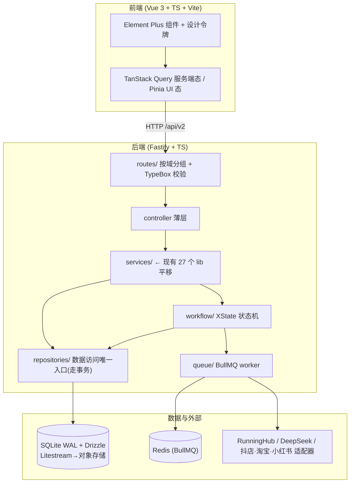

# 系统重构方案与工程化最佳实践

> 本文档由一次多智能体调研产出综合而成:6 路并行审计现有系统(前端 / 后端 / 数据层 / 工程基建 / UX / 领域实现)+ 6 路并行调研业界最佳实践(前端栈 / 后端架构 / 数据库 / 工作流引擎 / 工程基建 / 电商运营台 UX)→ 3 路综合(UX 重设计 / 目标架构 / 重构路线图)。
>
> 贯穿全文的核心约束:**已有可跑的 MVP + 完整 docs + 真实经营数据(27 商品 / 372 日志)+ 个体工商户、单人或极小团队、技术力有限**。所有取舍以「投入产出比」「单人能否长期维护」为准,而非「架构最优」。
>
> 生成日期:2026-06-16。

---

## 执行摘要(先读这一页)

### 一句话结论

**这套系统「值得救」,不该推倒重写。** 你拥有的是一个「产品设计极成熟(docs 满分级)、业务流程已验证、但工程地基近乎为零」的系统——业务知识是最贵的资产,它已经沉淀在代码和文档里。正确做法是**就地、增量、护栏先行的「绞杀者模式」渐进重构**,而不是另起新仓重写(重写是本项目最高风险、最易烂尾的选项)。

### 四个已核实的致命硬伤(都有真实证据)

| 严重度 | 问题 | 证据(已核实) | 后果 |
|---|---|---|---|
| **P0 安全** | API 完全裸奔,`POST /api/state` 可一键覆盖整个数据库 | `server.js` `writeDb(JSON.parse(body))`,全文件无任何鉴权 | 任何人能清空/篡改全部经营数据 |
| **P0 安全** | 渲染原语 `infoBox` 不转义,用户/AI 内容直插 DOM | `app.js:1964` `<strong>${value}</strong>` | 存储型 XSS,可被注入脚本批量操控发布/上架 |
| **P0 数据** | 单 JSON 文件全量读改写,并发丢更新、无事务、无约束 | `lib/db-service.js` 读全量→改→`writeAtomic` | 与数据量无关、**现在就在损坏数据** |
| **P0 数据** | 状态多真相源已实际分叉 | 真实数据 P1025/P1022:商品 `imageStatus=已生成` 但节点 `generate_image=失败` | 待办/进度全部失真,运营被误导 |

外加结构性病根:前端 4470 行单文件 + 56 字段全局可变 state + `innerHTML` 全量重渲染(丢焦点/丢滚动/丢输入,已留下 `setSelectionRange` 补丁伤疤)+ 假进度条(`app.js:1230` 硬编码 `--value:65%`);后端 2071 行单文件里一个 `handleApi` 巨函数串 50+ 个 `if` 路由,无校验、无统一错误处理、无异常兜底;**全项目零工程化基建**(无 TS / 测试 / lint / CI / 构建)。

可维护性评分:前端 **3/10**、后端约 **3/10**、数据层约 **2/10**、工程化约 **1/10**。

### 推荐目标技术栈(全 TS、单机可部署、无重型基础设施)

| 维度 | 现状 | 推荐 | 备选 |
|---|---|---|---|
| 前端框架 | 原生 JS 4470 行单文件 | **Vue 3 + TS**(或轻量路线:原生 ESM + `lit-html` 局部渲染) | React + TS |
| 组件库 | 手写 CSS 2226 行 | **Element Plus** | Ant Design |
| 前端状态 | 全局可变 state + 11 游离数组 | **TanStack Query(服务端态)+ Pinia(UI 态)** | 仅 Pinia |
| 后端框架 | 原生 http + `handleApi` 巨函数 | **Fastify**(一份 schema = 校验+类型+文档) | Express + Zod |
| 数据库 | `data/db.json` 单文件 | **SQLite(WAL)+ Drizzle + Litestream 备份** | 托管 Postgres |
| 工作流引擎 | `if` 顺序分支硬编码推进 | **XState 状态机 + BullMQ 队列** | 自研状态转移表 |
| 鉴权 | 无 | **session + cookie** | 共享密钥 Bearer |
| 工程基建 | 无 | **Biome + Vitest + GitHub Actions + Sentry + Pino** | ESLint+Prettier 散件 |
| 部署 | 手动 `node server.js` | **Railway / Render(免运维 PaaS)+ PM2** | Docker + Fly.io |

**明确不要上(对单人是负债不是资产):** NestJS、整库 DDD / Clean Architecture、Temporal / Step Functions、Kafka / RabbitMQ、MongoDB、Next.js / Nuxt SSR、k8s、monorepo(Turborepo/Nx)、DAG 画布(React Flow)做工作流编辑器。

### 目标架构总览



### 五阶段路线图(每阶段结束系统都可用、可回滚)

```
阶段0 工程地基 ─► 阶段1 数据层 ─► 阶段2 后端框架化 ─► 阶段3 工作流引擎 ─► 阶段4 前端+UX
(安全网·1周)    (止数据损血·L)   (统一契约·L)        (保护核心资产·L)     (消灭前端P0·L)
```

- **阶段 0(第一周,几乎零风险,最高性价比):** Git 卫生(把 mp4/jsonl 移出仓库)、Biome、进程异常兜底+PM2、Vitest 测核心纯函数、GitHub Actions CI、TS checkJs 起步、Sentry+Pino。
- **阶段 1(最危险,务必慎重):** SQLite+Drizzle 替换 JSON,一次性幂等 ETL 迁移真实数据,状态改为「从节点派生」杜绝分叉,时间戳转真实 UTC,ID 改 ULID,logs 先迁出主库。
- **阶段 2:** Fastify 绞杀 `handleApi`,逐条路由迁移 + TypeBox 校验 + 统一错误 envelope + session 鉴权 + **删除/锁死 `POST /api/state`**。
- **阶段 3:** XState 重写工作流推进(推进与执行分离),`PLATFORM_CHAINS` 节点定义原样迁移,observe 节点做成真「等待→超时转人工」状态机,BullMQ 带幂等键防重复上架/扣费,演示模式从「默认真」改「显式真」。
- **阶段 4:** 前端消灭全局 state + 全量重渲染 + XSS;导航砍到「今日工作台 / 商品·工作流 / 发布与素材 + 配置」;工作流页改可点击节点导轨;去假进度条;轮询改局部 patch、中期上 SSE。

### 给非技术维护者的一句话

**即使后面阶段没精力做完,只要做完阶段 0 + 阶段 1,你就拿到了大部分净收益**——系统不再丢数据、改动有护栏、出错能看见。建议「找靠谱兼职/外包顾问在阶段 0、1 深度介入 + 自己边学边做 2/3/4」,不要全职招人(单人项目养不起),更不要听信「推倒重写更干净」。

### 必须保留并迁移的核心资产(不要推倒)

- `lib/platform-workflow-engine.js` 的 `PLATFORM_CHAINS`(三平台节点链声明式定义,最值钱的领域知识)
- `lib/publish-service.js` 的 `validatePublishPreconditions`(近纯函数的库存/授权/限流规则)
- `lib/runninghub-client.js`(唯一真打通的外部集成)
- `lib/store-listing-service.js` 的上架 payload 构造、`lib/account-utils.js` 的矩阵角色模型、`lib/platform/adapter-factory.js` 适配器工厂
- 整个 `docs/`(成品级设计文档,是各阶段实现蓝本)、启动页三栏向导、CSS `:root` 设计令牌

---

> 以下为三份完整综合产出原文。

---

# 第一部分 · 目标技术架构与技术栈推荐

## 0. 一句话目标架构主张

> **保留你最值钱的资产（27 个 lib 业务 service + RunningHub 客户端 + 三平台节点链定义），用「Vue 3 SPA + Fastify 三层后端 + SQLite/Drizzle + XState 工作流引擎 + BullMQ 队列」这一套全 TypeScript、单机可部署、无重型基础设施的栈，把现状的「能跑的原型」改造成「单人也维护得动的可演进系统」——核心纪律是：所有改造都走绞杀者模式（一条路由、一个模块地搬），绝不大爆炸重写。**

为什么是这套而不是别的:你的真实约束不是「性能不够」或「并发不够」,而是 **「单人/个体工商户、技术能力有限,既要补齐工程硬伤,又不能被复杂度压垮」**。因此每一个选型的评判标准都是「**总维护负担 / 投入产出比**」,而不是「能力上限」。下面所有推荐都严格遵守这条。

上方架构图展示了五层结构与数据回流闭环的全貌。

---

## 1. 现状 → 目标 技术栈对照表

| 维度 | 现状 | 目标推荐 | 备选 | 复杂度（对小团队） |
|---|---|---|---|---|
| **前端框架** | 原生 JS,4470 行单文件 + 全局可变 state | **Vue 3（Composition API）+ TS** | React + TS | 中 |
| **前端组件库** | 手写 CSS 2226 行,无组件 | **Element Plus** | Ant Design | 低 |
| **前端状态管理** | 一个 56 字段全局 `const state` + 11 个游离数组 | **TanStack Query（服务端态/轮询）+ Pinia（UI 态）** | 仅 Pinia + 手写轮询 | 中 |
| **前端构建** | `<script src>` 直引 + 手改 `?v=` | **Vite + 内容哈希** | — | 低 |
| **工作流画布 UI** | 不可点的状态清单 + 硬编码 65% 假进度 | **左侧竖向节点导轨（Vue Flow 只读/轻编辑）** | DAG 画布（不推荐) | 中 |
| **后端框架** | 原生 http,2071 行 `handleApi` + 50 个 if | **Fastify（plugin 分组路由）** | Express + 散件 | 中 |
| **后端分层** | service 直接 mutate 整个 db,无边界 | **controller → service（现有 lib）→ repository** | — | 中 |
| **输入校验** | 散落的 `String(x\|\|'').trim()`,无 schema | **TypeBox**（Fastify 原生,一份 schema 出校验+类型+文档） | Zod | 低 |
| **错误处理** | 50 个分支各自处理,有遗漏致请求挂死 | **AppError 基类 + `setErrorHandler` 集中处理 + 错误码** | — | 低 |
| **API 契约** | 无,前端靠读源码 | **`@fastify/swagger` 自动生成 OpenAPI** | tRPC（不推荐,前端非 TS 同仓) | 低 |
| **数据库** | `data/db.json` 单文件全量读改写 | **SQLite（WAL 模式）** | 托管 Postgres（Supabase/Neon） | 低 |
| **ORM / 迁移** | 手写 `readAndWrite` + 读时 `migrateAll` | **Drizzle ORM + drizzle-kit 版本化迁移** | Prisma（更适合纯小白） | 中 |
| **数据备份** | 无 | **Litestream → 对象存储** | 定时 cp 快照 | 低 |
| **工作流引擎** | `if (node.type===...)` 顺序分支 + 自递归 | **XState 状态机（持久化快照入库）** | 自研显式状态转移表 | 中 |
| **任务队列** | `setTimeout` 回调跑 AI 生成 | **BullMQ + Redis（重试退避 + 幂等键）** | 数据库表当队列 + 轮询 | 中 |
| **鉴权** | 完全无,API 裸奔 | **session + cookie（`@fastify/secure-session`）** | 共享密钥 Bearer（最低保） | 低 |
| **日志可观测** | 零散 `console.error` | **Pino 结构化日志 + Sentry 免费档** | 仅 Pino | 低 |
| **类型系统** | 纯 JS,无类型 | **渐进 TS（allowJs→JSDoc→逐文件转 .ts→strict）** | 仅 `// @ts-check` + JSDoc | 中 |
| **测试** | 0 | **Vitest（纯逻辑单测）+ Playwright（1-3 条关键链路）** | 仅 Vitest | 中 |
| **代码规范** | 无 lint,自写 `check-js.js` | **Biome（lint+format 一体,单配置)** | ESLint flat + Prettier | 低 |
| **CI** | 无 | **GitHub Actions（biome ci + typecheck + test）** | — | 低 |
| **部署** | 手动 `node server.js` | **Railway 或 Render（免运维 PaaS）+ PM2 兜底** | Docker + Fly.io | 低 |

---

## 2. 关键选型详解（推荐 + 备选 + 理由 + 不要上什么）

### 2.1 前端框架：Vue 3（推荐）vs React（备选）

**推荐 Vue 3，理由直指你的核心约束。** 调研明确指出:本场景的核心矛盾是「维护者技术能力有限」,而 Vue 的模板语法 + Element Plus 的中文生态 + Pinia 的简单 store,整体心智负担显著低于 React 的 JSX + Hooks 闭包陷阱 + 状态库选型纠结。**对单人后台,「能长期改得动」比「上限高」更重要。** 国内 Vue 后台生态最厚(Element Plus、Soybean Admin 脚手架),中文文档/招聘/AI 编码语料齐全。

**何时反而选 React:** 仅当「节点式工作流编辑器是产品核心、且要做到精致可拖拽」时——React + React Flow 是上限最高、衔接最顺的组合。但鉴于你的工作流本质是「采集→AI生成→适配→审核→发布」的弱分支线性流,**用不到 DAG 画布的全部能力**(见 §4),所以这条理由对你不成立 → 坚持 Vue。

**复杂度评级:中。** 重写前端是这次重构最大的单项工程,但基于 Soybean / Vue Element Plus Admin 脚手架二开,而非从零搭,可省掉权限路由/布局/菜单的轮子。

### 2.2 前端状态管理:TanStack Query + Pinia(推荐)

这是 2025 后台前端最重要的架构习惯,**直接根治你的 P0-1(全局可变状态混乱)**:把「服务端真值」(商品/任务/工作流状态、轮询)交给 TanStack Query(原生处理缓存、`refetchInterval` 轮询、失效重取);把「纯 UI 态」(表单开关、选中 id、当前 tab)留给 Pinia。**服务端状态 ≠ 全局状态** 这条分工,一举消灭现状的「11 个游离 let 数组 + 轮询全量覆盖冲掉用户输入」。

**复杂度评级:中。** 概念上要理解「服务端态/客户端态分离」,但这正是替代现有混乱的关键,值得投入。

### 2.3 后端框架:Fastify(推荐)vs Express(备选)

**推荐 Fastify——它是小团队的甜点位。** 用同一份 schema 一次解决「校验 + 类型 + 文档」三件事,这对人手少的维护者是最大杠杆:TypeBox schema 写一遍,自动得到运行时校验、TS 类型、Swagger 文档。性能是 Express 的 1.5-2 倍(用不上但不亏),且有 `@fastify/express` 兼容层支持绞杀者式渐进迁移。

**备选 Express:** 若你对 Fastify 的 plugin/封装模型没把握、想要最大人才池和 AI 辅助资料,用 Express + Zod 同样可行——只是校验、错误中间件、Swagger 都要自己拼装散件,工作量更碎。

**复杂度评级:中(会 Express 的话 1-2 天上手 Fastify)。**

### 2.4 数据库:SQLite + Drizzle(推荐)vs 托管 Postgres(备选)

**推荐 SQLite + Drizzle + Litestream——这是从「演示数据结构」到「真数据库」复杂度最小的一跳。** 它和现在一样是「一个文件」(`data/app.db`),不需要装数据库服务、不需要 DBA、不需要 Docker,运维心智几乎不变,但白拿:① `BEGIN…COMMIT` 事务 → 直接消灭审计发现的 **P0「主写路径绕过互斥导致丢失更新」**;② 外键 + 唯一约束 → 消灭孤儿数据和 ID 复用;③ 索引 → 消灭全表 O(n) 扫描;④ 只改涉及的行 → 消灭 439KB 全量读写放大。开 WAL 模式支持「多读单写」,Litestream 挂在 WAL 上近实时复制到对象存储,补齐 SQLite「单文件易丢」的唯一短板。

**ORM 微调:** Drizzle 的迁移文件是人类可读的 SQL(出问题你看得懂、改得动);若维护者**几乎不碰 SQL、最怕看不懂数据库**,可换 **Prisma**(对象式 API + `prisma migrate` 全自动 + Prisma Studio 可视化看数据,学习成本最低),代价是包重、二进制大。

**备选托管 Postgres(Supabase/Neon):** 仅当你**明确预判**要多台应用同时高频写、或想顺手打包 auth/storage 时才选。对你当前单机、27 商品级别,**这是过度基础设施**。

**复杂度评级:低(SQLite 本身)/ 中(Drizzle 需懂一点 SQL)。**

### 2.5 鉴权:session + cookie(推荐)

对**内部系统/管理后台/浏览器同域**,共识压倒性偏向 session 而非 JWT:内部工具最看重「立即吊销」(删 session 即时生效),JWT 的无状态/跨服务优势你这个单体用不上,反而引入黑名单/刷新令牌的复杂度。**最低保底版:** 哪怕先只加一个共享密钥 Bearer 中间件,也必须立刻堵上现状的 P0「API 完全裸奔 + `POST /api/state` 可一键覆盖整库」。

**复杂度评级:低。**

### 2.6 明确不要上的「大厂级方案」(过度设计清单)

这些在本场景是**纯复杂度税、负资产**,综合多位调研专家的一致结论:

| 不要上 | 为什么对你是过度设计 |
|---|---|
| **NestJS** | DI/装饰器/模块是为 3+ 人团队设计的护栏,对单人是持续的复杂度税 |
| **整库 DDD / Clean Architecture / 六边形** | 你没有溢出 service 层的领域复杂度(除工作流引擎一处),全量上让每天的改动都变贵 |
| **Temporal / Restate / Step Functions** | 要求集群部署 + 理解确定性重放约束;你的并发量级和可靠性要求远未到质变点 |
| **Kafka / RabbitMQ** | 单体内部系统用 BullMQ 足够,消息中间件是大厂级过度设计 |
| **MongoDB** | 你的数据是强关系型,文档库会逼你在应用层手写 join 和一致性,方向错了 |
| **Next.js / Nuxt SSR 全家桶** | 内部后台无 SEO 需求,SSR/RSC 只增不减复杂度 |
| **shadcn/ui 作主组件库** | 「拥有式」把 bug 修复/升级/一致性维护责任全转移给你,对单人是净负担 |
| **Turborepo / Nx / k8s / 多环境 Docker / 自建可观测栈** | 单人团队的纯负债;部署用 Railway/Render PaaS 即可 |
| **DAG 画布(React Flow)做工作流编辑器** | 性能+维护黑洞;你的弱分支线性流用节点导轨足够(见 §4) |

---

## 3. 后端重组:不推倒 27 个 lib,长出三层结构

**核心策略:绞杀者模式 + 你的 27 个 service 几乎零改动。** 现有 lib 模块本来就是 service 层,业务建模质量高(`platform-workflow-engine`、`validatePublishPreconditions`、`runninghub-client`、适配器工厂都是值钱资产)。要做的只有三件:① 在每个 service 前加一层**薄 controller**(解析+校验入参、调 service、统一返回);② 把 50 个 if 拆成按领域分组的**路由文件**;③ 引入 **repository 层**,让 service 不再直接 mutate 全局 db。

### 目标目录结构

```
src/
├─ app.ts                      # Fastify 实例装配:插件/钩子/错误处理/swagger
├─ config/
│  └─ env.ts                   # Zod 校验 process.env,启动 fail-fast,强类型 config
├─ plugins/
│  ├─ auth.ts                  # session+cookie 鉴权(@fastify/secure-session)
│  ├─ error-handler.ts         # setErrorHandler:AppError → {code,message,timestamp}
│  └─ logger.ts                # Pino + request-id
├─ routes/                     # ← 替代 2071 行 handleApi 的 50 个 if
│  ├─ products.routes.ts       # controller 层:TypeBox schema + handler
│  ├─ workflows.routes.ts
│  ├─ assets.routes.ts
│  ├─ publish.routes.ts
│  └─ accounts.routes.ts
├─ services/                   # ← 现有 27 个 lib 平移到这里,逻辑几乎不动
│  ├─ publish-service.ts       # 纯业务规则(validatePublishPreconditions 抽成纯函数)
│  ├─ store-listing-service.ts
│  ├─ runninghub-client.ts     # 保留,补 fetch 超时 + 幂等键
│  └─ ...(其余 24 个)
├─ workflow/                   # ← 工作流引擎(见 §4)
│  ├─ machine.ts               # XState statechart 定义
│  ├─ chains.ts                # PLATFORM_CHAINS(从旧引擎平移的节点链定义)
│  └─ executors.ts            # 副作用 step(可注入、可 dry-run、可单测)
├─ repositories/               # ← 新增:数据访问唯一入口,service 不再碰 db
│  ├─ product.repo.ts          # getProductById / saveProduct(走事务)
│  ├─ workflow.repo.ts
│  └─ ...
├─ db/
│  ├─ schema.ts                # Drizzle 表定义 + 外键
│  ├─ client.ts                # SQLite(WAL)连接
│  └─ migrations/              # drizzle-kit 版本化迁移(替代读时 migrateAll)
├─ queue/                      # ← BullMQ
│  ├─ workers/                 # AI生成/上架/发布 worker
│  └─ queues.ts
└─ errors/
   └─ AppError.ts              # 基类:statusCode/code/isOperational
```

**迁移落地顺序(增量、可回滚):**
1. 先加**与框架无关**的 3 件套:Zod env 校验 + Pino + AppError/集中错误处理(立刻收益,最低风险);
2. 引入 Fastify,用绞杀者模式**一条资源路由一条地**从 `handleApi` 搬出,每条配 TypeBox schema;
3. 给现有 service 各加薄 controller,**service 内部逻辑不动**;同步引入 repository,把「读-改-写」收敛进事务;
4. 最后接 `@fastify/swagger` 白送文档、鉴权切 session。

---

## 4. 工作流引擎目标设计:XState 状态机 + BullMQ + 统一节点抽象

**主张:用 XState 把「硬编码 if 推进」重写为显式状态机,把「待确认/观测/可重试」三类特殊节点统一抽象为同一个 suspend/resume 原语。** 这直接根治审计发现的引擎硬伤:推进与执行混在一起、observe 不是状态机(三元两边相同的未写完逻辑)、retry 不清理副作用、两套引擎读写同一商品状态串味。

### 4.1 节点的统一抽象(关键洞察)

调研指出:**「待确认节点」和「等外部平台同步节点」本质相同——都是「挂起、持久化、靠外部信号(人点按钮 / webhook / 轮询命中)唤醒」**。因此把所有节点归为三种执行语义:

| 节点语义 | 例子 | 执行模型 |
|---|---|---|
| **副作用节点(可重试)** | 调 RunningHub 生图、调抖店上架 API | 投递 BullMQ 任务 → 指数退避+jitter重试 → **幂等键防重复上架/重复扣费** → 成功/失败回写状态机 |
| **人工介入节点(suspend)** | 预览确认、异常人工处理 | 状态机停在 `待确认` state,等前端「确认/重试/跳过」事件唤醒;跳过为危险操作,需二次确认+后果提示 |
| **观测节点(suspend + 超时)** | 授权号橱窗同步、精选联盟挂载 | 状态机停在 `等待同步` state,带 `deadline`;能 webhook 就 webhook 唤醒,否则 BullMQ 重复任务带退避**轮询平台状态**;命中→`已同步`,超时→`转人工确认` |

这三者用 XState 的 state + event + delayed transition 天然表达,**彻底消除 `if (node.type===...)` 顺序分支**。

### 4.2 数据模型要点(状态单一真相源)

直接回应审计的 **P0「状态字段多真相源已实际分叉」**(P1025:商品说"已生成"但节点说"失败"):

- **流程执行状态的唯一真相源 = `WorkflowNode.status`**(从 `nodes[]` 数组提升为独立表)。商品卡片上的 `imageStatus/copyStatus/videoStatus` **不再落库**,改为 SQL 视图/查询时派生 → 分叉在结构上不可能再发生。
- 工作流实例状态用 XState `getPersistedSnapshot()` 序列化存进 SQLite,需要时 `createActor(machine,{snapshot})` 水合恢复 → 进程崩溃/部署后能从断点续跑。
- **节点状态枚举统一为受控词表**(对齐文档 §3 的 7 态:未开始/可执行/执行中/待确认/已完成/失败/已跳过),并配唯一配色映射,消灭现状的 3 套词汇并存。
- **时间戳一律真实 ISO-8601 UTC**(逐出 `"刚刚"/"今天14:06"` 这类展示字符串),否则风控的「日上限/间隔≥4h」永远做不出来。
- **ID 用 ULID** 替代「扫表取 max+1」,天然有序、并发无冲突、删除不复用。

### 4.3 执行模型要点(推进/执行分离)

- **推进(transition)只负责状态流转,执行(executor)下沉为可注入、可 dry-run、可单测的 step**——解决审计的「推进=执行不可分、无法单测」。
- **retry 必须清理副作用**:重置节点前回滚已写的 `externalId`、清 `taskIds[]`,避免重复发布任务。
- **部分失败要诚实**:3 个授权号挂 2 个,节点不能整体标成功;失败账号单独可重试。
- **演示模式从「默认真」改成「显式真」**,UI 明确区分「演示成功 / 真实成功」,避免出资人误判系统已具备真实带货能力。
- 旧 `workflow-engine.js`(商品维度引擎)确认无 UI 引用后**删除**,消除两套引擎串味。

**为什么不上 Temporal:** 你几乎不满足「成千上万并发流 + 金融级不丢状态 + 专职运维」任一条件 → XState(零依赖、可画状态图、易测试)+ BullMQ(你引入 Redis 后增量极小)是正解。将来 suspend/resume 手写成本变高,再平滑升级到 Trigger.dev 自托管。

---

## 5. 数据层迁移目标:关系模型 + 一次性 ETL

**主张:用一个幂等的 Node ETL 脚本把 `db.json` 一次性导入 SQLite,本地与生产用同一种库,不搞双写。** 你是单机、单写、停机几分钟无所谓 → 不需要 expand-contract 那套零停机重型方案。

### 目标关系模型(规范化后核心实体)

```
Product ─┬─< Asset(成品,kind=image|copy|video)
         ├─< GenerationTask(生成任务,FK assetId)
         ├─< ListingTask(上架,FK accountId)
         ├─< PublishTask(发布,FK accountId,删 account 名字段只留 accountId)
         └─< PlatformWorkflow ─< WorkflowNode(节点状态唯一真相源)
Account ─────< (被 Listing/Publish 引用)
OperationLog(独立存储,迁出主库,最先做,立刻让主库写入变快)
PlatformProductMapping(替代内联的 platformProductIds 对象)
```

**关键决策:** ① 删除商品上的 `imageStatus` 等派生状态字段,改视图派生;② 删除子实体里冗余的父字段(`generationTasks.productName`、`publishTasks.account`),改 JOIN;③ 所有时间戳转真实 UTC;④ 外键 + 唯一约束由存储层保证(不再靠 27 个 service 手工 `Array.find` 维护)。

### 一次性迁移方案要点

1. **建 Drizzle schema**:把 7 类实体定义为表 + 外键,先抽样读 `db.json` 把隐含字段/类型/引用显式化;
2. **写幂等 ETL 脚本**:读 `db.json` → 转换(拆 `nodes[]` 为独立表、转时间戳、去冗余、生成 ULID 并保留旧 displayCode 映射)→ 按依赖顺序(先父后子)bulk insert,**重复跑两次不能炸**(upsert 或先清空目标表);
3. **先迁 logs 出主库**(最快见效、风险最低);
4. **建字段映射对照表**,跑完用计数/抽样校验「旧记录数=新记录数、关键引用无孤儿」;
5. **切换**:应用从读写 db.json 改为走 repository/Drizzle,验证通过后 `db.json` 留只读备份一段时间再退役;
6. 开 WAL + 外键约束,跑现有功能回归。

---

## 6. 落地优先级(一句话路线图)

> **第 0 批(重构动工前,1-2 天,与代码长相解耦的安全网):** 清二进制 + `.gitignore` 卫生 → Biome → Sentry 免费档 → CI 管道骨架 → 进程级异常兜底 + PM2。
> **第 1 批(治 P0 硬伤):** 上 SQLite/Drizzle(灭并发丢更新)→ 加 session 鉴权 + 删/锁 `POST /api/state`(灭裸奔)。
> **第 2 批(治结构,绞杀者迁移):** Fastify 路由表 + TypeBox 校验 + 统一错误 + repository 层 + Pino;前端基于 Soybean 脚手架重写为 Vue3 + TanStack Query + Element Plus;工作流引擎重写为 XState + BullMQ。
> **第 3 批(护城河,持续):** Vitest 锁住纯逻辑(风控/状态机/校验)+ Playwright 1-3 条关键链路 + Dependabot;部署迁 Railway/Render。
> **几乎不会上:** Temporal / NestJS / 整库 DDD / Kafka / MongoDB / k8s / DAG 画布——对单人团队都是负债不是资产。

---

**关键依据来源(专家产出与调研):** 前端 Vue+TanStack Query 分离(前端审计 P0-1/P0-2 + 前端调研路线 A);Fastify+TypeBox+session+绞杀者迁移(后端审计 P0/P1 + 后端调研首选栈);SQLite+Drizzle+Litestream+幂等 ETL(数据层审计 P0-1/P0-3 + 数据库调研首选);XState+BullMQ+suspend/resume 统一抽象+幂等键(领域审计 P0-2/P1-1/P1-3 + 工作流调研首选);Biome+Vitest+Sentry+Railway 地基(工程基建调研 🅰🅱 两批);节点导轨而非 DAG 画布、待办驱动工作台、SSE 优先(UX 调研页面 B/A 推荐)。

---

# 第二部分 · UX 与页面重设计建议

> 适用约束：维护者为个体工商户 / 单人或极小团队、技术能力有限。本章所有方案在「上限」与「省心」冲突时一律选**省心可持续**;并明确标注「先做 / 后做」,让前端可以分批照着实现。本章不假设已迁移到框架——下列布局与交互在「原生 JS 局部渲染」或「Vue 3 + Element Plus」下都成立,只是后者实现成本更低。

---

## 1. 现有页面问题的提炼(为什么现在不是最佳实践)

把六份 UX 相关审计的结论收敛成**三个结构性病根**,它们叠加导致了「太简陋、可维护性差」的直觉:

**病根一:导航是「模块清单」而非「工作流程」,且与设计文档自相矛盾。** 当前侧边栏实际有 8 个入口(`index.html` L21-32:今日工作台 / 商品管理 / 平台工作流 / ＋新建商品 / 发布任务 / 素材库 / 平台账号 / 库存),而 `docs/04` 的应然是「一级 3 项」。更糟的是「商品管理」点下去被 `setView` 重定向到 workflow 视图(`app.js`,`if (view==="products") view="workflow"`),两个并列按钮落到同一页;「＋新建商品」把一个**动作**混进了**导航**;高频运营对象「库存」却被降级进「必要配置」二级区。结果是运营者在「商品 / 工作流 / 素材」三个名字间反复猜「我的商品做到哪一步该点哪里」。这违反了导航项与目的地一一对应、7±2 上限、动作与地点分离的基本原则。

**病根二:核心工作流页只是「状态清单」,不是真正的节点式工作流,且异步反馈是假的。** 左栏节点列表(`renderPlatformWorkflowNodeList`)的 `<li>` **不可点击**——无法回看已完成节点的产物、无法预览后续节点、无法手动跳节点重做,它退化成了一个进度条;执行中进度条是**硬编码 `--value:65%`** 的假进度,永远不动;更要命的是整套异步更新走「2 秒 `setInterval` 全量轮询 → `applyDataState` 覆盖 → `viewRoot.innerHTML` 整页重建」,这会清空滚动位置、丢失输入框焦点、冲掉正在填的表单——以至于 `renderProducts` 末尾要手写 `input.focus()+setSelectionRange` 把光标抢回来(这本身就是反模式留下的伤疤)。一个「每天高频确认 / 重试」的运营台,用户填一半被清空、进度条卡在 65%、点了没反应,信任会被持续消耗。

**病根三:没有设计系统,也没有可访问性基线。** 几十个 `renderXxx` 函数各自手拼 `innerHTML`,十六进制颜色(`#93c5fd #eff6ff #2563eb`)和内联 `style` 散落在 JS 字符串里几百处,绕过了 `:root` 里已定义的 CSS 变量;状态色有三套并存(`statusPill` / 节点 `.active/.done/.failed` / inbox `.inbox-danger/warn/info`);`infoBox` 等渲染原语**不转义**用户/AI 内容(存储型 XSS);大量交互元素是 `<article data-action>` / `<li>` 而非语义按钮,键盘和读屏不可达。界面因此「看起来像几个人拼的几个页面」,且改一处样式要全局搜替。

> 一句话:**导航答非所问、工作流名不副实、异步反馈造假、视觉各写各的**。这四点不是孤立 bug,而是「没有以工作流为中心做信息架构 + 没有局部渲染 + 没有设计系统」三件事缺失的必然结果。

---

## 2. 目标信息架构(导航 / 页面地图)

### 2.1 推荐的导航结构:3 个主入口 + 1 个配置区 + 1 个常驻动作

```
┌─ 侧边栏(可折叠) ────────────────┐
│  [LOGO]                          │
│                                  │
│  ● 今日工作台      ← 默认落地页   │   一级:每天第一眼看的待办驾驶舱
│  ● 商品 · 工作流    ← 产品主战场   │   一级:商品列表 + 单商品平台工作流
│  ● 发布与素材       ← 内容矩阵     │   一级:发布任务矩阵 + 素材库(合并)
│  ──────────────                  │
│  设置                            │   二级折叠:平台账号 / 库存 / 系统配置
│    · 平台账号                     │
│    · 库存管理                     │
│    · 系统设置(密钥/演示模式开关)  │
│                                  │
│  [＋ 新建商品]   ← 常驻主 CTA      │   动作:固定在侧栏底部或顶栏右上,不占导航项
└──────────────────────────────────┘
```

### 2.2 各对象如何归位与取舍理由

| 对象 | 归位 | 取舍说明 |
|---|---|---|
| **今日工作台** | 一级,默认页 | 运营者每天的入口是「现在该做什么」,不是「数据长什么样」。学 Linear Triage:待办优先。 |
| **商品 + 平台工作流** | **合并为一个一级「商品·工作流」**,商品列表是入口、单商品工作流是详情 | 当前最大的概念过载就来自「商品管理」和「平台工作流」是两个按钮一个页。合并后:列表页(总览所有商品 + 进度)→ 点进某商品 = 该商品的三平台工作流详情。**商品是中心,工作流是它的详情视图**,符合 `docs/04` 的「商品运营台」原意。 |
| **发布任务 + 素材库** | **合并为一个一级「发布与素材」**,用 Tab 或左右分区切换 | `docs/09 §2` 明确「素材库不应成为主操作入口」「AI 能力嵌入节点」。素材本质是「发布的弹药」,与发布任务强相关。合并后,素材以「平台 × 状态」矩阵呈现,而不是按文件类型分桶的资源管理器。真正在工作流里要用素材时,走**节点内的素材抽屉**,不必跳来这里。 |
| **＋新建商品** | 从导航移除,改为**常驻主 CTA**(侧栏底部按钮 + 列表页右上角) | 动作不进导航。点击进入录入向导(沿用现有做得不错的启动页三栏)。 |
| **库存** | 降到「设置」二级,但**在工作台待办里高频暴露** | 库存数据的「修改」是低频配置,但库存预警的「处理」是高频待办——所以编辑入口放设置,告警入口放工作台。两者分离解决了「高频对象被藏起来」的矛盾。 |
| **平台账号** | 「设置」二级 | 真正「配一次」的配置,放二级合理。 |
| **系统设置(密钥 / 演示模式)** | 新增「设置」二级 | 把 `PLATFORM_DEMO_MODE` 这类开关显式化,并在 UI 标注「当前为演示模式 / 真实模式」,避免出资人误判系统已具备真实带货能力(领域审计 P0-3)。 |

**导航从 8 项压到「3 + 设置 + 1 CTA」**,每个一级项语义独立、与目的地一一对应,移除了「商品管理→workflow」的隐性重定向。**这是性价比最高的单点 IA 改造**,几乎零技术成本(只是删按钮、改路由映射),但直接消除最大的认知过载。

---

## 3. 三个核心页面的重设计方案

### 3.1 今日工作台 / 运营驾驶舱

**设计目标:** 5 秒内回答「现在该处理哪件事」。学 Linear Triage——按卡点分组、一键跳转、可稍后处理。

**布局结构(从上到下):**

```
┌─ 顶部 KPI 条(一行,每张卡可点击下钻)──────────────────────┐
│ [待处理 12]  [生成失败 3]  [待发布 5]  [库存预警 2]  [今日已发 8]│
└──────────────────────────────────────────────────────────────┘
┌─ 待办工作区(主体,占视觉中心)────────────────────────────┐
│  分组① 需我决策(待确认节点)         [全部展开/折叠]        │
│    ▸ 智能恒温杯 · 抖音链路 · 图片待确认   [去确认 →] [稍后] │
│    ▸ 便携风扇 · 小红书 · 文案待确认       [去确认 →] [稍后] │
│  分组② 生成失败 · 需重试                                    │
│    ▸ XX · 抖音 · 视频生成失败(原因:超时) [重试][跳过][详情]│
│  分组③ 待发布 / 待上架                                      │
│  分组④ 库存预警                                            │
└──────────────────────────────────────────────────────────────┘
┌─ 首次引导(可关闭,关闭后不再常驻)────────────────────────┐
│  录入 → 推进节点 → 跟进发布   [知道了,不再显示]            │
└──────────────────────────────────────────────────────────────┘
```

**关键组件与交互:**
- **KPI 卡可下钻**:点「生成失败 3」→ 直接筛出这 3 条到待办区或跳到对应列表(治审计 P2「KPI 是展示而非入口」)。每个数字旁给环比/趋势小标。
- **待办按「卡点/优先级」分组,不按模块**:优先级排序 = 阻塞上架/发布 > 生成失败待重试 > 缺素材 > 库存预警。
- **同商品同事项去重**:当前 `buildInboxItems` 会让一个商品的「缺素材 + pw 等待确认 + 资产待确认」同时出现三条;重设计后按 `商品 × 平台 × 节点` 唯一聚合,一条待办对应一个可处理的节点。
- **每条待办一个主操作**:`[去确认 →]` 一键跳到该商品工作流的**该节点**(持久化 URL,如 `#/product/P1027/workflow/douyin/generate_image`),不丢上下文。
- **稍后处理(snooze)**:把不紧急的待办折叠,支持异步批处理节奏。
- **教学卡降级**:`renderOperatingPath` 的三步教学从常驻改为「首次可见 + 可永久关闭」。

**状态可视化:** 每条待办左侧一个状态色点(见 §4 状态色表),失败项用红、待确认用琥珀(最需介入的态要有**专属醒目色**,不能并入普通蓝)。

**空 / 错 / 加载态:**
- **空态(无待办)**:正向文案「今日待办已清空 ✓ 可以去录入新商品」+ 主 CTA,而非空白。
- **加载态**:骨架屏渲染 KPI 卡和 3 行待办占位(结构匹配最终布局),不要裸 spinner。
- **错态**:聚合接口失败时,在待办区显示**内联可重试错误块**(「待办加载失败,[重试]」),信息可复现,而不是一闪而过的 toast。

**参考产品:** Linear(Triage 分组 + 一键跳转 + snooze + 持久化 URL)、Shopify Admin Home、抖店工作台。

---

### 3.2 单商品 · 平台工作流页(节点式)

**核心决策:用「左侧竖向节点导轨 + 中间当前节点工作面 + 右侧上下文对照」三栏,不上 DAG 画布。** 调研明确:你的流程是「采集→AI 生成→平台适配→审核→发布→回流」的弱分支线性流,竖向节点导轨完全够用;React Flow 类画布对小团队是「性能 + 维护」黑洞,明确不建议。

**布局结构:**

```
┌─ 平台泳道选择(顶部,可一屏比较三平台卡点)──────────────────┐
│ [抖音 ●卡在视频生成]  [小红书 ✓已完成]  [淘宝 ◷上架中 4/6]    │
└────────────────────────────────────────────────────────────────┘
┌── 左:节点导轨 ──┬─── 中:当前节点工作面 ───┬── 右:上下文对照 ──┐
│ ✓ 商品资料       │  ▶ 视频生成              │ 当前节点相关素材   │
│ ✓ 主图生成       │  状态:执行中(不定态)   │  [生成中的视频预览] │
│ ✓ 文案生成       │  模板:换装短视频 v2     │                    │
│ ● 视频生成 ◀当前 │  ┌─────────────────────┐ │ 商品信息           │
│ ○ 上架主店       │  │  生成结果预览区        │ │  名称/价/库存/SKU  │
│ ○ 授权号发布     │  └─────────────────────┘ │                    │
│ ○ 达人号发布     │                          │ 本节点操作日志     │
│ ○ 数据回流       │  ┌─ 固定底部操作条 ─────┐ │  14:06 提交生成    │
│                  │  │ [确认并继续][重试][跳过]│ │  14:07 上传素材    │
└──────────────────┴──┴───────────────────────┴─────────────────────┘
```

**关键组件与交互:**

1. **左栏节点可点击(治审计 P0-6 最高优先项)**:每个节点 `<button>`(语义化、可 Tab 聚焦、`aria-current="step"` 标当前节点)。点击行为:
   - 点**已完成**节点 → 中栏切到该节点,展示其产物(回看主图/文案)。
   - 点**未来**节点 → 中栏预览该节点要做什么(只读说明 + 前置条件)。
   - 点**失败**节点 → 中栏展示失败原因 + 重试入口。
2. **三平台一屏可比(治审计 P0-9)**:顶部泳道不再只显示 `xx%`,而是「平台名 + 卡点节点 + 是否需我介入」。该商品未勾选的平台不渲染空 Tab(消除噪音)。
3. **中栏固定底部操作条**:`确认并继续 / 重试 / 跳过` 永远在同一位置、视觉权重分明(确认=主色实心,重试=次级,跳过=幽灵按钮+红色文字)。**肌肉记忆**得以建立——高频「确认下一步」每次都在同一处。
4. **危险操作有保护**:「跳过」加二次确认弹层 + 明示后果(「跳过『上架主店』将导致后续发布节点无法执行,确定?」),不与「确认」同权重裸放。
5. **右栏真正承担对照(治审计 P0-11)**:当前节点相关素材预览 + 商品信息 + **本节点操作日志**(把日志从整页底部挪进右栏),三栏并排对照,确认上架时无需大幅滚动。右栏可收起以扩大中栏工作面。
6. **单一真相源的「下一步」**:废弃 `getProductNextAction`(商品维度旧字段)与 `pw.nodes`(节点状态机)两套并存的指引逻辑,**统一以节点状态机为准**(治审计 P0-7 + 领域审计 P0-3 的状态分叉)。

**状态可视化(节点状态唯一受控词表,与 `docs/09 §3` 对齐):**

| 节点状态 | 颜色 | 图标 | 含义 |
|---|---|---|---|
| 未开始 | 灰 `--node-idle` | ○ | 前置未满足 |
| 可执行 | 蓝 `--node-ready` | ◔ | 可点击执行 |
| 执行中 | 蓝(脉动) | ◑ 动 | 异步进行中 |
| **待确认** | **琥珀 `--node-wait`** | ⏸ | **最需介入,专属醒目色** |
| 已完成 | 绿 `--node-done` | ✓ | |
| 失败 | 红 `--node-fail` | ✕ | 旁显失败原因 |
| 已跳过 | 灰虚线 | ⤳ | 进度计算**不计入完成**(治审计 P2-1 进度虚高) |

**空 / 错 / 加载 / 重试态:**
- **加载**:进入工作流页时,左栏节点导轨用骨架占位,中栏显示「加载工作流…」。
- **执行中**:**去掉假 65% 进度条**,改用不定态(脉动节点 + spinner)或真实进度文案(「正在生成视频,预计 30-60 秒…」)。
- **失败**:中栏顶部红色错误块,含**具体原因**(`node.error`)+ `[重试本节点]` + `[跳过]`;左栏失败节点旁也显示错误摘要(不必进中栏才看到)。
- **重试要幂等**:重试前端只发「重试」事件,后端按 idempotency key 防重复上架/重复扣费(领域审计 P1-3:重试不清理副作用是已知 bug,前端 UI 配合后端把重试做成可安全重放)。

**参考产品:** Clarity / PatternFly 多步工作流规范、Ant Design Steps(竖向)、Temporal/n8n 的执行态可视化(只借鉴「节点状态高亮」,不借鉴画布)。

---

### 3.3 发布与素材(多平台内容矩阵)

**设计目标:** 一眼看全「每个商品 × 每个平台」的发布状态;素材作为发布弹药内联其中。

**布局结构(顶部 Tab 切「发布矩阵 / 素材库」):**

**Tab A — 发布矩阵(主视图):**
```
┌─ 筛选条 ────────────────────────────────────────────────┐
│ [平台▾] [状态▾] [时间▾]   [批量操作 ▾]   [保存为视图]    │
├─────────┬──────────┬──────────┬──────────┬───────────────┤
│ 商品     │ 抖音      │ 小红书    │ 淘宝      │               │
├─────────┼──────────┼──────────┼──────────┼───────────────┤
│ ☐ 恒温杯 │ ✓已发(3号)│ ◷待审    │ ✓已上架   │ [展开账号明细]│
│ ☐ 便携扇 │ ✕失败(2)  │ ○草稿    │ ◑适配中   │               │
└─────────┴──────────┴──────────┴──────────┴───────────────┘
```
- 一行一个商品,一列一个平台,每格 = 该平台发布状态色块 + 简述。
- 抖音格可展开「1主店 + 3授权号 + N达人号」的**账号级明细**(对应 `multiAccount` 节点),显示每个账号的发布状态——直接服务于母文档的矩阵语义。
- **部分失败诚实呈现**:格内「✕失败(2)」可点开看「3 授权号中 2 个失败」,提供 `[仅重试失败账号]`(治领域审计 P2-2:部分失败被吞)。

**Tab B — 素材库:**
```
┌─ 筛选:[商品▾][类型:图/文/视频▾][状态▾]  [批量:应用到N个平台]┐
├──────────────────────────────────────────────────────────────┤
│ Index Table:☐ 缩略图 | 所属商品 | 类型 | 版本 | 状态 | 操作  │
│  (固定表头 + 固定「商品」列 + 可滚动表体)                      │
└──────────────────────────────────────────────────────────────┘
```

**关键组件与交互:**
- **批量操作栏**:选中 ≥1 行后顶部浮出批量条;**选择基于素材 ID 不基于行索引**(筛选/排序后不误伤);大批量加二次确认。
- **筛选 + 保存视图**:列表 >50 条分页;支持「保存为视图」(如「抖音待审」「全部失败」)。
- **toast 升级**:批量结果用带类型的 toast(success 绿 / error 红),支持堆叠 + 「查看详情」,不再单例覆盖(治审计 P2「toast 无类型无堆叠」)。

**状态可视化:** 复用 §4 同一套状态色,跨页面一致(矩阵格、素材状态、待办点用同一映射)。

**空 / 错 / 加载 / 确认 / 重试态:**
- **空态**:无素材时「该商品还没有成品,去工作流生成 →」引导回工作流。
- **AI 生成中**:骨架屏 + **具体进度文案**(「正在为小红书改写文案…」),失败项置顶,提供「仅重试失败平台」。
- **确认**:发布是高后果操作,发布前弹确认摘要(发到哪些账号、用哪条素材)。

**参考产品:** Hootsuite / Sprinklr(统一日历 + 多渠道状态矩阵 + 平台自动适配)、Shopify Polaris Index Table + Index Filters(批量 / 筛选 / 保存视图 / 空态)。

---

## 4. 设计系统建议(令牌 + 组件规范)

**对小团队的明确结论:不上重型 token 工具链,用一套维护良好的 CSS 变量即可。** 现有 `:root` 已有变量(`styles.css` L1-17)是正确起点,问题是 JS 模板里大量十六进制和内联 style **绕过了它**。重构的核心动作是「把所有颜色/间距收进变量 + 禁止 JS 里写十六进制」。

### 4.1 设计令牌(扩充 `:root`)

```css
:root {
  /* —— 颜色:语义化,不直接用色值 —— */
  --color-bg: #eef2f6;
  --color-panel: #ffffff;
  --color-text: #17212b;
  --color-muted: #64748b;
  --color-line: #dbe3ec;
  --color-primary: #2563eb;       /* 主操作 */
  --color-primary-weak: #eff6ff;  /* 主操作浅底,替代散落的 #eff6ff */

  /* —— 状态色(唯一受控,跨页面共用)—— */
  --status-idle: #94a3b8;   /* 未开始-灰 */
  --status-ready: #2563eb;  /* 可执行-蓝 */
  --status-running:#0f9f8f; /* 执行中-青 */
  --status-wait: #b7791f;   /* 待确认-琥珀(最醒目)*/
  --status-done: #138a54;   /* 已完成-绿 */
  --status-fail: #c2413b;   /* 失败-红 */
  --status-skip: #cbd5e1;   /* 已跳过-灰虚线 */

  /* —— 间距(8pt 网格,中文 B2B 偏紧凑)—— */
  --space-1: 4px;  --space-2: 8px;  --space-3: 12px;
  --space-4: 16px; --space-5: 24px; --space-6: 32px;

  /* —— 排版(中文正文 13-14px,行高 1.5)—— */
  --font-sans: Inter, "PingFang SC", "Microsoft YaHei", sans-serif;
  --text-xs: 12px; --text-sm: 13px; --text-base: 14px;
  --text-lg: 16px; --text-xl: 20px; --text-2xl: 24px;
  --leading: 1.5;

  /* —— 圆角 / 阴影 —— */
  --radius-sm: 6px; --radius-md: 10px; --radius-lg: 14px;
  --shadow-sm: 0 1px 3px rgba(15,23,42,.06);
  --shadow-md: 0 18px 45px rgba(15,23,42,.08);
}
```

**排版规则(中文 B2B):** 行距 ≈ 字号 1.5 倍;**数字列右对齐 / 小数点对齐**(价格、库存列尤其重要);中英文左对齐;用「大/中/小三档间距」表达信息亲密度分组,避免糊成一片。

### 4.2 组件规范(约 12 个核心组件,统一一处定义)

| 组件 | 用途 | 替代现状的散乱写法 |
|---|---|---|
| `Button`(primary/ghost/danger/small) | 所有按钮 | 收编 `.primary-btn/.ghost-btn/.small-btn/.chip-btn` |
| `Card` | 面板容器 | 收编 `.panel/.account-card/.task-item/.kpi-card` |
| `StatusBadge` | 状态展示 | **唯一**状态色映射,收编三套状态样式 |
| `NodeItem` | 工作流节点 | 可聚焦、带 `aria-current`、七态色 |
| `Toast`(success/error/warning) | 反馈 | 带类型 + 堆叠 + 操作 |
| `EmptyState` / `Skeleton` | 空/加载态 | 新增,当前缺失 |
| `FormField` | 表单项 + 内联校验 | 统一就近校验提示 |
| `DataTable` | 列表/矩阵 | 固定表头 + 批量 + 筛选 |
| `Modal` / `ConfirmDialog` | 确认 | 替代 `confirm()/alert()` 阻塞弹窗 |
| `Drawer` | 节点内素材抽屉 | 新增 |

### 4.3 一致性与可维护性如何被保障

- **强制纪律:JS 模板里禁止出现十六进制色值和内联 `style`**,一律用 CSS 变量 + class。这一条可用一个简单的 lint 规则或 `check-js.js` 扩展来机械检查(grep `style="` 和 `#[0-9a-f]{6}` 在 app.js 中的出现并告警)。
- **`escapeHtml` 默认化**:渲染原语(`infoBox` 等)默认转义,显式 `unsafe()` 才放行,从结构上消灭存储型 XSS(治审计 P0-3),不再靠「逐处记得加」。
- **图标统一**:用一套单色 SVG icon(可主题着色),替换 emoji(📷🎬 在不同 OS 渲染不一致)。
- **若迁移到 Vue + Element Plus**:上述组件大半由组件库直接提供(Steps/Table/Form/Badge/Drawer),令牌通过 Element Plus 的 CSS 变量覆盖即可,自研成本进一步降低——这是设计系统落地最省力的路径。

---

## 5. 异步任务体验规范(替代裸轮询)

这是 AI 电商工具的体验命门,也是当前最糟的部分(假进度 + 全量轮询 + 整页重建)。规范如下,**前端可直接照做**:

**原则一:状态以服务端为唯一可信源,提交即返回句柄。** 触发 AI 生成/发布 → 后端立即返回任务句柄(`taskId` + 初始状态),前端不阻塞。**通知/推送可能丢,不能只靠它**,状态查询端点才是权威。

**原则二:用「局部更新」彻底替换「整页 innerHTML 重建」(治审计 P0-13)。** 轮询/推送回来的变更**只 patch 变化的那个节点卡 / 那一行任务**,绝不重渲染整个 `viewRoot`。这一条同时根治:焦点丢失、滚动跳动、表单被冲、`setSelectionRange` 补丁。

> 若仍用原生 JS:给每个节点/任务卡一个稳定 `data-id`,更新时 `querySelector` 定位后只改该卡的状态 class 和文案。若迁 Vue:响应式数据驱动,天然局部更新。

**原则三:传输方式优先级(小团队取舍)。**
1. **首选 SSE(Server-Sent Events)**:单向、自带断线重连、实现比 WebSocket 简单。后端就是「服务端单向推任务进度」,SSE 是最佳匹配。
2. **退而求其次:带退避的轮询**:指数退避(2s→4s→8s,封顶)+ **终态停止**(任务到 `已完成/失败` 即停),+ **页面隐藏时暂停**(`visibilitychange`)。这比当前「固定 2s 无限全量轮询」省资源得多,且治了「`tasks` 视图已被移除导致轮询在多数页面不触发重渲染」的 dead code 问题。
3. WebSocket 仅在未来需要双向/协作时才上。

**原则四:进度要具体,不要假进度也不要裸 spinner。**
- **删除硬编码 `--value:65%`**。
- 有真实进度 → 显示「步骤 4/6」或「124/500」。
- 无法获知百分比 → 用不定态(脉动/骨架)+ **预计耗时文案**(「生成视频中,通常 30-60 秒」)。
- 2-10 秒等待 → 骨架屏,且结构匹配最终布局。

**原则五:乐观更新配幂等 + 失败回滚。** 点「确认并继续」可乐观地把节点标成「执行中」让 UI 立即响应,但:① 提交带 idempotency key(防重试重复上架/扣费);② 失败时回滚 UI 状态并显示**可操作的错误**(不要「出错了」,要「视频生成超时,[重试] 或 [跳过]」)。

**原则六:部分失败诚实呈现。** 批量发布到多账号时,结果显示「3 成功 / 2 失败 / 1 跳过」,失败项置顶,提供「仅重试失败项」。

---

## 落地优先级(给前端的执行顺序)

**先做(低成本、立刻见效,治 P0):**
1. 导航压到「3 + 设置 + 1 CTA」,删除「商品管理→workflow」重定向(纯删改,半天)。
2. 异步:删假进度条 → 不定态 + 真实文案;轮询改局部 patch + 终态停止 + 退避(根治焦点/滚动/表单丢失)。
3. 左栏节点改为可点击 `<button>` + `aria-current`;中栏固定底部操作条(确认/重试/跳过)。
4. 渲染原语默认转义,消除 XSS。

**后做(随重构推进):**
5. 设计令牌落地 + 禁止 JS 内十六进制/内联 style;状态色三套合一。
6. 工作台改 Linear Triage 式分组待办 + KPI 下钻;发布矩阵 + 素材合并。
7. 语义化/键盘可达/SSE 实时推送/移动端节点 stepper。

---

**关键文件路径(供前端实现时定位现状,均绝对路径):**
- `C:/testji/yunyingxitong/index.html` — 导航骨架(L20-33 待改);单 `#viewRoot` 容器(L51,局部渲染改造点);`?v=` 手动缓存(L7/57)
- `C:/testji/yunyingxitong/app.js` — `setView` 重定向、`renderPlatformWorkflowNodeList`(节点不可点击)、硬编码 `--value:65%`、`startTaskPolling`(2s 全量轮询)、`render`(整页 innerHTML 总调度)、`infoBox`(未转义)、`buildInboxItems`(待办去重改造点)
- `C:/testji/yunyingxitong/styles.css` — `:root` 令牌(L1-17,扩充起点);响应式断点(节点导轨移动端改造点)
- `C:/testji/yunyingxitong/docs/04-information-architecture.md` 与 `docs/09-core-platform-workflow-design.md` — IA 与节点状态机的「应然」对照

---

# 第三部分 · 重构策略与分阶段路线图

> 本章基于前述 6 份审计（前端/后端/数据层/工程基建/UX/领域实现）与 6 份调研（前端栈/后端架构/数据库/工作流引擎/工程基建/UX）综合得出。核心约束始终是：**已有可跑的 MVP + 完整 docs + 真实经营数据（27 商品/372 日志）+ 个体工商户单人或极小团队、技术力有限**。所有取舍都围绕「投入产出比」和「单人能否长期维护」，而非「架构最优」。

---

## 0. 一句话总纲

**就地、增量、护栏先行**——不另起新仓重写，不大爆炸式推倒；先用 1 周铺好「能在改动时兜住错误」的工程地基，再用绞杀者模式从**数据层**这个最危险的硬伤开刀，逐层（数据→后端→工作流引擎→前端→UX）替换，每一阶段系统都仍可用、可回滚。

---

## 1. 重构策略选择：三条路线的评估与推荐

### 1.1 三个选项摆在桌面上

| 策略 | 本质 | 对本项目的适配度 |
|---|---|---|
| **A. 另起新仓重写（Big Bang Rewrite）** | 新建仓库、新栈，从零实现，旧系统并行到切换日 | ❌ 不推荐 |
| **B. 就地改造（In-place Refactor）** | 在现有文件里直接改，不引入并行结构 | ⚠️ 部分可用，但单独不够 |
| **C. 绞杀者模式（Strangler Fig）渐进重构** | 新结构与旧代码并存，一块一块地把功能从旧路径迁到新路径，最终旧路径枯萎删除 | ✅ **推荐（主线）** |

### 1.2 为什么不选「另起新仓重写」

重写是本项目**最危险的选项**，理由有四，全部有审计证据支撑：

1. **业务知识的复现成本被严重低估。** 领域审计明确指出，`platform-workflow-engine.js` 的 `PLATFORM_CHAINS`（抖音 12/小红书 9/淘宝 6 节点的声明式链定义）、`validatePublishPreconditions`（库存/授权/日限流的近纯函数规则集）、`runninghub-client.js`（唯一真打通的外部集成，含三态素材解析+轮询+超时）是「产品经理+开发反复打磨的领域知识沉淀」。重写意味着把这些**已经验证过的业务规则重新踩一遍坑**，而单人团队没有这个预算。

2. **真实数据的存在让「切换日」变成高风险事件。** 已有 27 商品/24 工作流/119 素材/372 日志的真实经营数据。重写必然伴随一次性大迁移，而数据层审计已发现**数据本身就有状态分叉**（P1025/P1022 的 `imageStatus="已生成"` 但节点 `generate_image="失败"`）——脏数据迁进全新 schema 会在切换日集中爆雷。

3. **「第二系统效应」对单人团队是致命的。** 重写期间旧系统仍要维护（运营每天在用），等于一个人同时维护两套系统 + 追赶移动靶。业界对小团队的共识（见后端调研 solodevstack、工作流调研 daily.dev）是「迁移成本低、可回滚」优先于「架构最优」。

4. **docs 已是成品级，但 docs ≠ 可运行系统。** 文档完整反而是「重写陷阱」的诱因——容易让人以为「照着 docs 重写一遍就好」，但 docs 描述的是「应然」，代码里有大量「实然」的边界处理（migrateAll 的 legacy 映射、focus 补丁、三态素材解析）是 docs 没写的。

### 1.3 为什么「就地改造」单独也不够

就地改造在**地基阶段**（加 lint、加测试、清仓库）是对的，但对**结构性硬伤**无能为力：

- 前端 4470 行单文件 + 全局可变 state + innerHTML 全量重渲染，是「字符串拼接 XSS + 丢焦点 + 无法局部更新」三个 P0 的根，**就地小改无法消除**——必须引入并行的新渲染结构。
- 后端 1190 行 `handleApi` if 链 + JSON 文件并发丢更新（P0-1）、无鉴权（P0-2）、无异常兜底（P0-3），就地改只能打补丁，无法获得「框架的统一校验/错误/路由」。

所以**就地改造是手段，不是策略**——它服务于地基阶段，但主线必须是绞杀者。

### 1.4 推荐：绞杀者模式（Strangler Fig）渐进重构

**核心做法**：在同一个仓库里，让「新结构」与「旧代码」并存，按**边界清晰的功能块**逐块迁移，每迁完一块就让旧路径枯萎删除。具体到本项目的四个落点：

- **后端**：新框架（Fastify）与旧 `http` server **并存**，用 `@fastify/express` 兼容层或反向代理，**一条路由一条路由地**从 `handleApi` 搬出（后端调研明确给出此路径）。旧 if 分支搬空一条删一条。
- **数据层**：新 SQLite + 仓储层（repository）与旧 `db-service.js` 并存，service 层签名先不动，底层实现切换；用一次性幂等 ETL 灌数据，旧 `db.json` 留作只读备份。
- **工作流引擎**：用 XState 重写推进逻辑，但**保留 `PLATFORM_CHAINS` 节点定义原样迁移**（它本就是声明式配置）。
- **前端**：这是唯一可能需要「新建子项目」的部分（若上 Vue/React + Vite）。即便如此也走绞zhe者——新前端先只接管 1-2 个页面，与旧 `app.js` 通过同一套后端 API 并行，逐页替换。

### 1.5 重构期如何保持系统可用（这是绞杀者的命门）

1. **永远有一个「当前可用版本」**。每个阶段结束都必须是一个可部署、可回滚的稳定点。绝不允许「重构进行到一半、系统跑不起来」的状态跨越多天。
2. **Feature flag / 路由分流**。新旧路径用开关或 URL 前缀（如 `/api/v2/*` 走新框架）分流，出问题一键切回旧路径。
3. **数据层「双读单写」过渡**（仅数据迁移阶段需要）：迁移期旧 `db.json` 作为只读真相源备份，新库为写入主路径，校验两边一致后再退役旧文件。
4. **地基先行提供安全网**。这是为什么第 2 节的工程地基**必须在动结构之前完成**——没有测试和类型，绞杀者的每一次「搬一条路由」都是盲改（工程基建审计：「测试=0+类型=0+lint=0是可维护性差的头号根因」）。
5. **小步提交、按主题拆 commit**。当前工作区有 28 个未提交改动 + 9 个未跟踪文件，本身就是「随时丢失、无稳定回滚点」的风险（工程基建审计 P3）。重构期必须改成高频小提交。

---

## 2. 工程地基清单（动工第一周，按性价比排序）

> 原则：这批**与「代码长什么样」解耦**，是重构期间「不出大事的安全网」，必须在动结构之前铺好。全部针对单人/技术力有限优化——**一次配置、长期自动生效、零持续运维**。预估总工作量 **1 周内**（其中第 1-3 项半天到一天即可见效）。

### 第一优先级（半天～1 天，立刻止血，重构动手前必做）

**① Git 卫生：把二进制和数据移出仓库** ｜成本 1 小时 ｜性价比 ★★★★★
- `.gitignore` 补 `*.mp4`、`data/*.jsonl`（runninghub-debug-log）、`data/*.tmp.*`、`*.log`。工程基建审计确认：根目录两个 mp4（3MB+1MB）和 debug jsonl **未被忽略，离一次 `git add .` 就进历史**——一旦进 git 历史永久膨胀且极难清除。
- `data/db.json` 已被正确忽略（保持）。
- 把当前 28 个未提交改动**按主题拆成几个有意义的小提交**落盘，建立第一个稳定回滚点。
- 这是**全清单中第一刀**：风险最低、收益最高、防止不可逆的仓库污染。

**② 一体化 lint + format：Biome** ｜成本 0.5 天 ｜性价比 ★★★★★
- 选 **Biome**（而非 ESLint+Prettier 散件）。工程基建调研给出明确理由：单二进制、单配置文件（`biome.json`）、比 ESLint+Prettier 快 10–25×、取代 127+ npm 包——**对技术力有限的单人维护者是最优解**，没有插件地狱。
- `biome check --write` 一条命令同时 lint+format。开 `no-unused-vars`/`no-undef`/`eqeqeq` 等，**立刻扫出现存隐性 bug**（前端审计提到的影子变量、`==`、未用变量）。
- 备选：若未来要重度依赖某些 ESLint 专有插件，再退回 ESLint flat config——但起步用 Biome。

**③ 进程级错误兜底 + 健康检查 + PM2** ｜成本 0.5 天 ｜性价比 ★★★★★
- 后端审计 P0-3：`http.createServer(async...)` 无顶层 try/catch，无 `process.on('uncaughtException'/'unhandledRejection')`——一个畸形请求就能让进程崩溃或请求挂死。
- 加：① handler 最外层统一 try/catch → 500；② 两个 process 级 handler 记录日志+优雅降级；③ `/health` 端点探测 db 可读/可写（现有 `/api/health` 只返配置，是假健康检查）；④ 用 **PM2**（不是 K8s/Docker）做 `pm2 start` 自动重启+开机自启。
- 这条虽属「修 bug」而非「地基」，但因为是 P0 且半天可done，放进第一周。

### 第二优先级（1～2 天，重构安全网）

**④ Vitest 骨架 + 核心纯函数测试** ｜成本 2–3 天 ｜性价比 ★★★★★
- 装 Vitest（零配置、一个 devDependency），**不追求覆盖率，只测「改一次就可能全盘崩的纯逻辑」**：`validatePublishPreconditions`、`db-service` 的 `writeAtomic`/`migrateAll`/`normalizeDb`、`nextId`、各 `lib/platform/adapters/*`、`computeLocalListingCompleteness`。
- 这些是 lib/ 里最纯、最高危、最易测的部分。**有了它们，后续每一次绞杀者「搬一块」才有回归网**，否则全是赌博。

**⑤ GitHub Actions CI 管道（占位即可）** ｜成本 2 小时 ｜性价比 ★★★★☆
- 一条 yml：`npm ci` + `biome ci` + test job（先占位，随 ④ 填充）+（未来）`tsc --noEmit`。
- 一次配置永久生效、零运维。让 ②④ 的护栏**强制**而非「靠记得跑」，坏代码进不了 main。

### 第三优先级（各 0.5 天，可与重构并行）

**⑥ TypeScript 渐进引入（先 checkJs + JSDoc）** ｜成本 启动 0.5 天 ｜性价比 ★★★★☆
- **不要大爆炸迁移**（工程基建调研：会一次炸出几千错误导致搁置）。建 `tsconfig.json` 开 `allowJs:true + checkJs:false + strict:false + incremental:true`。
- 关键动作：用 JSDoc + `// @ts-check` 给**核心数据形状**（Product/Asset/Task/中文状态枚举）加类型，让 VS Code 免费给类型检查。前端审计、领域审计都强调「中文状态字符串当枚举用，散落十几处，极易拼错」——这是 TS 最先该锁住的。
- **正式 .ts 迁移合并进重构做**（拆 app.js/server.js 时顺手转，避免改两遍）。

**⑦ Sentry 免费档 + Pino 结构化日志** ｜成本 0.5 天 ｜性价比 ★★★☆☆
- Sentry Developer 免费档（5K errors/月）5 分钟接入，重构期线上崩溃立刻可见。
- Pino 替换散落的 `console.error`，结构化 JSON 日志，重构期可查。
- 这两项让重构期「出了问题能看见」，但优先级低于测试和类型。

**⑧ 目录规整 + `.nvmrc` + Dependabot** ｜成本 0.5 天 ｜性价比 ★★★☆☆
- `.nvmrc` + package.json `engines.node` 锁 Node 版本。
- Dependabot（仓库开关一开，零配置）+ CI 跑 `npm audit`（注意：当前 registry 锁到 npmmirror，audit 端点不可用，需在 CI 里临时切官方 registry 跑 audit）。
- 目录规整留到阶段一随后端拆分一起做，此处只做最小约定。

> **不要在第一周做的事**（避免过度工程）：TS 全量 strict、Docker、monorepo、E2E、SQLite 迁移本身。这些属于后续阶段或「按需触发」。

---

## 3. 分阶段路线图（5 个阶段）

> **阶段排序的核心逻辑**：先消除「与数据量无关、现在就在丢数据/损坏数据」的硬伤（数据层），再消除「让每次改动都很痛」的结构债（后端→工作流→前端）。
>
> **为什么数据层最先？** 数据层审计的关键论断：**并发丢更新（P0-1）和状态分叉（P0-3）与数据量无关，现在就在发生**；而「一旦投入真实经营、有后台自动化任务在跑，就已越过安全线」。数据是不可再生资产，丢了无法回滚——所以它排第一。
>
> **为什么后端在前端之前？** 前端的数据获取、错误处理、状态形状全依赖后端 API 的契约。先把后端的统一 envelope、校验、错误码做对，前端重构才有稳定的契约可依赖（前端审计 P1-2、后端审计 P1-4 互为印证）。
>
> 工作量级别：**S** ≈ 数天 / **M** ≈ 1–2 周 / **L** ≈ 3–5 周（单人口径）。

---

### 阶段 0：工程地基（第 1 周）

| 项 | 内容 |
|---|---|
| **目标** | 在不改业务结构的前提下，建立「改动时能兜住错误」的安全网 |
| **范围** | 第 2 节全部 8 项 |
| **交付物** | Biome 配置 + CI 跑通；Git 仓库清干净（无 mp4/jsonl）；核心纯函数 Vitest 测试（≥10 个）；进程异常兜底 + PM2 + /health；tsconfig（checkJs 起步）；Sentry+Pino 接入 |
| **风险** | 低。唯一注意：清理 git 历史里的大文件若已误入需谨慎（当前尚未误入，只需 ignore） |
| **工作量** | **M**（约 1 周） |
| **验收标准** | ① `git status` 干净、mp4/data 不再被跟踪；② `biome ci` + `vitest` 在 GitHub Actions 绿；③ 杀掉进程能被 PM2 自动拉起；④ 故意抛异常不会让整个 server 挂死 |

---

### 阶段 1：数据层迁移到 SQLite（消灭数据损坏硬伤）

| 项 | 内容 |
|---|---|
| **目标** | 用 SQLite 替换 JSON 单文件，根治并发丢更新、写放大、无约束、无事务、状态分叉 |
| **范围** | ① 引入 **SQLite（WAL）+ Drizzle ORM**（数据库调研首选；若维护者几乎不懂 SQL 可换 Prisma）；② 按规范化模型建表（见下）；③ 写**一次性幂等 ETL** 把 db.json 灌入；④ 在 `db-service.js` 后面加一层 repository，**保持 27 个 service 的函数签名不变**，只换底层实现；⑤ 强制所有写走事务/串行 |
| **关键设计决策**（综合数据层审计第五节） | • **状态单一真相源**：`imageStatus/copyStatus` 等不再落库，改为从 `GenerationTask.status`/`WorkflowNode.status` **派生**（SQL 视图或查询聚合）——结构上杜绝 P1025 式分叉；• **时间戳一律真实 UTC datetime**，把 `"刚刚"/"今天14:06"` 逐出存储层（这也是后续风控、数据回流的前提，领域审计 P3-2）；• **ID 改 ULID/UUIDv7** 替代扫表 `max+1`（消灭并发冲突+删除复用，数据层 P1-2）；• **logs 迁出主库**先做（最快见效，主库写入立刻变快）；• **WorkflowNode 从内嵌数组提升为独立表** |
| **交付物** | `schema.ts`（Drizzle）+ `migrations/` 版本化迁移目录 + 幂等 ETL 脚本 + repository 层 + Litestream 自动备份到对象存储 |
| **风险** | **数据迁移风险（最高）**：脏数据（已分叉状态）灌入新 schema 会暴露。缓解：ETL 跑前先做一次「状态对账修复」；ETL 幂等可重跑；迁移后用计数+抽样校验「旧记录数=新记录数、关键外键无孤儿」；db.json 留只读备份至少 1 个月 |
| **工作量** | **L**（约 3–4 周） |
| **验收标准** | ① 所有现有功能在新库上回归通过（靠阶段 0 的测试 + 手点关键链路）；② 并发压测两个写请求不丢更新；③ 外键约束开启、无孤儿数据；④ 商品状态从节点派生、无法再人为分叉；⑤ Litestream 能从备份精确恢复 |

> **目标实体（规范化后，来自数据层审计）**：Product / Account / Asset / GenerationTask / ListingTask / PublishTask / PlatformWorkflow / WorkflowNode（独立表）/ OperationLog（独立库）/ PlatformProductMapping。外键 + 唯一约束 + 枚举约束 + 审计三件套（createdAt/updatedAt/deletedAt 真实时间）。

---

### 阶段 2：后端框架化（绞杀 handleApi 巨函数）

| 项 | 内容 |
|---|---|
| **目标** | 用 Fastify 替换 1190 行 if 链，获得统一路由/校验/错误/鉴权/文档；补齐 P0 安全硬伤 |
| **范围** | ① 引入 **Fastify**（后端调研首选：一份 schema 同时给校验+类型+OpenAPI 文档，对单人最省力；27 个 service 几乎零改动）；② **绞杀者逐条迁移**：用 `@fastify/express` 兼容层让新旧并存，一条资源路由一条地从 handleApi 搬出，搬空一条删一条；③ 每条路由配 **TypeBox/Zod schema 校验**（替换手写 `String(x||'').trim()`）；④ 统一响应 envelope `{ok,data?,error:{code,message}}` + 集中错误处理器（`setErrorHandler`）；⑤ 加 **session+cookie 共享密钥鉴权**（后端调研：内部后台 session 优于 JWT）；⑥ **删除/锁死 `POST /api/state`**（无保护的整库覆盖，P0-2）；⑦ Zod 校验 env、启动 fail-fast；⑧ 每个 service 前加薄 controller |
| **交付物** | `routes/` 按域分文件（products/workflows/publish/assets/accounts）+ schema 定义 + 鉴权中间件 + 自动生成的 Swagger 文档 |
| **风险** | 中。绞杀期新旧路由并存易混乱→用 `/api/v2/*` 前缀分流、迁完即删旧分支。鉴权加上后前端需同步带 token→同阶段配合改 |
| **工作量** | **L**（约 3–4 周） |
| **验收标准** | ① handleApi 巨函数完全清空删除；② 所有端点有 schema 校验，畸形输入返 422 而非污染数据；③ 统一错误响应；④ 无鉴权请求被拒；⑤ Swagger 文档可访问（前端可据此对接） |

---

### 阶段 3：工作流引擎显式状态机化（保护并升级核心资产）

| 项 | 内容 |
|---|---|
| **目标** | 把「硬编码 if 推进」重写为显式状态机，分离「推进」与「执行」，补齐 observe 等待状态机与风控 |
| **范围** | ① 用 **XState** 把工作流建成 statechart（工作流调研首选：节点=state、待确认/异常/等外部=显式 state、确认/重试/跳过=event），状态快照存进阶段 1 的 SQLite；② **`PLATFORM_CHAINS` 节点定义原样迁移**（本就是声明式配置，是最值钱资产）；③ **推进与执行分离**：副作用节点（调 AI/上架）交给 **BullMQ**（指数退避+jitter+幂等键防重复上架/扣费）；④ **observe 节点重写为真状态机**（领域审计 P0-2：`等待平台同步(带deadline)→轮询/手动复查→已同步/超时转人工`，让 `expectMinutes` 真正生效）；⑤ **删除旧 `workflow-engine.js`**（与平台引擎重复、读写同一商品状态会串味）；⑥ **演示模式从「默认真」改「显式真」**，UI 明确区分「演示成功/真实成功」（领域审计 P0-3）；⑦ retry 清理副作用（领域审计 P1-3） |
| **交付物** | `workflow/machine.ts`（XState）+ BullMQ 队列 + observe 轮询任务 + 风控模块（日上限/间隔，依赖阶段 1 的真实时间戳） |
| **风险** | 中高。XState 有学习曲线；BullMQ 引入 Redis 依赖（多一个进程，可用单机 Docker 或托管 Redis）。缓解：先只用 XState 重写推进逻辑，BullMQ 可后置；保留旧引擎做对照直到新引擎验证通过 |
| **工作量** | **L**（约 3–5 周） |
| **验收标准** | ① 节点推进由状态机驱动、无硬编码 if；② 失败节点 retry 不产生重复发布/上架；③ observe 节点有真实「等待→超时转人工」；④ 演示/真实成功在数据和 UI 上可区分；⑤ 旧 workflow-engine.js 已删除 |

---

### 阶段 4：前端重构（消灭全局 state + 全量重渲染 + XSS）

| 项 | 内容 |
|---|---|
| **目标** | 消除字符串拼接 XSS、全量 innerHTML 重渲染丢焦点、巨型全局可变 state、4470 行单文件 |
| **范围（两条路线，二选一）** | **路线甲（轻量，最契合单人维护）**：保留原生 JS 路线，引入 ~3KB 标签模板库（`lit-html`/`uhtml`，默认转义）做局部渲染 + 原生 ESM 按业务域拆文件 + 服务端/客户端状态分离。**零构建、零框架**，一次性干掉 3 个 P0（前端审计最高优先级建议）。**路线乙（上限高，若团队会增长或工作流编辑器是核心）**：Vue 3 + Element Plus + Vite + TS + Pinia/TanStack Query（前端调研首选，中文生态最厚、学习曲线最平），基于 Soybean/Vue Element Plus Admin 脚手架二开。**对单人/技术力有限，推荐路线甲**；只有当确认要长期投入且工作流画布是卖点时才上路线乙 |
| **同步做的 UX 改进**（综合 UX 审计+调研） | • 导航砍到「今日工作台/商品(工作流)/发布任务」+ 配置，与 docs/04 对齐；• 工作流页改**左侧可点击节点导轨**（非 DAG 画布，UX 调研明确建议小团队别上画布）；• **去掉假 65% 进度条**，用真实进度或骨架屏；• **轮询期只局部 patch 变化节点**（不整页重建），中期上 SSE 替代 2s 轮询；• 待办按「平台·节点」分组去重、可下钻；• 统一设计令牌（CSS 变量）+ 受控状态词表；• toast 加类型/堆叠 |
| **交付物** | 按域拆分的前端模块 + 局部渲染 + 默认转义模板 + 设计令牌 + 改造后的三类核心页 |
| **风险** | 中。路线乙若选则工程量翻倍且需学新栈→对单人是负资产，慎选。缓解：走绞杀者，新前端先接管 1-2 页，与旧 app.js 共用后端 API 并行 |
| **工作量** | 路线甲 **L**（3–4 周）/ 路线乙 **L+**（6 周+） |
| **验收标准** | ① 用户内容渲染默认转义、XSS 注入无效；② 轮询/操作时输入焦点和滚动位置不丢失；③ app.js 拆成多个 ESM 模块、无 4000 行单文件；④ 客户端状态与服务端数据分离、有唯一写入口 |

---

### 阶段顺序总结图（每阶段结束系统都可用）

```
阶段0 地基 ──► 阶段1 数据层 ──► 阶段2 后端 ──► 阶段3 工作流引擎 ──► 阶段4 前端+UX
(安全网)      (止数据损血)     (统一契约)      (保护核心资产)      (消灭前端P0)
  M             L               L               L                 L

每个 ──► 之间都是一个【可部署、可回滚的稳定点】
```

---

## 4. 风险登记表

| # | 风险类别 | 描述 | 概率/影响 | 缓解措施 |
|---|---|---|---|---|
| R1 | **数据迁移** | db.json 已有状态分叉脏数据（P1025/P1022），灌入约束化 schema 时爆雷或丢数据 | 高/高 | ETL 前先跑「状态对账修复脚本」；ETL 设计为幂等可重跑；迁移后计数+抽样+外键校验；db.json 留只读备份≥1月；Litestream 持续备份 |
| R2 | **范围蔓延** | 「顺便把风控/数据回流/真实平台对接都做了」导致阶段无限拉长 | 高/中 | 每阶段验收标准写死、「真实平台 API 对接」单独立项不混入重构；演示模式保留，不在重构期追求真实带货能力 |
| R3 | **真实平台 API 依赖** | 抖店/淘宝上架、橱窗同步、精选联盟当前全是 mock；`category_id:"demo_category"` 硬编码，真实对接是独立大工程 | 中/高 | 重构**不承诺**打通真实平台；保留 payload 构造逻辑（真实映射），只在适配器层留清晰扩展点；真实对接作为重构**之后**的独立里程碑 |
| R4 | **技术栈学习成本** | 单人需同时学 Fastify+Drizzle+XState+(可能)Vue，超出消化能力 | 中/高 | 严格按阶段串行、一次只学一个；优先选学习曲线平的（Biome/Drizzle/lit-html）；前端默认走零框架路线甲；XState/BullMQ 可先用最小子集 |
| R5 | **重构期系统不可用** | 绞杀中途出现「跑不起来」跨多天的状态 | 中/高 | 每阶段必须是可部署稳定点；新旧路径用 flag/前缀分流可一键回切；高频小提交；阶段 0 的 CI 守门 |
| R6 | **回归 bug** | 改动打破已验证的业务规则（如发布前置校验、矩阵分配） | 中/高 | 阶段 0 先给核心纯函数补测试作回归网；保留资产模块迁移时「先测后改」；旧引擎/旧路径保留作对照直到新路径验证通过 |
| R7 | **过度工程** | 引入 Temporal/K8s/Docker/monorepo/Postgres 等对单人是负债的重型设施 | 中/中 | 明确「不做清单」（见 §5.3）；所有选型以「单人能否长期维护」为唯一标准；SQLite 而非 Postgres、XState+BullMQ 而非 Temporal、PM2 而非 K8s |
| R8 | **密钥/安全** | 重构期 RunningHub/DeepSeek 付费密钥泄露或被无鉴权 API 滥用 | 低/高 | 阶段 2 尽早加鉴权;删 `POST /api/state`;确认密钥不进 Sentry/Pino/debug jsonl 日志;`.env` 已 ignore（保持） |
| R9 | **单点维护（人）** | 单人团队，重构中途中断（生病/事务）导致半成品搁置 | 中/高 | 每阶段独立交付、互不阻塞；文档同步更新（docs/08 进度）；commit 信息规范便于他人接手；优先做收益最高的阶段 0-1，即使后续中断也已有净收益 |

---

## 5. 保留资产清单（重构中必须保护并迁移）

> 综合各审计的「肯定性结论」——这些是已验证、高质量、不可轻易复现的资产，**重构时以它们为基底扩展，不要推倒**。

### 5.1 后端/领域核心资产（最高保护级）

| 资产 | 文件 | 为何保留 | 迁移方式 |
|---|---|---|---|
| **三平台节点链定义** | `lib/platform-workflow-engine.js` `PLATFORM_CHAINS`(:8) | 抖音12/小红书9/淘宝6 的声明式节点链，是「最有价值的领域知识沉淀」 | 原样迁为 XState 配置/JSON，**不重写节点定义** |
| **发布前置校验** | `lib/publish-service.js` `validatePublishPreconditions`(:45) | 近纯函数的库存/授权/日限流规则，「写得很好」 | 独立成纯函数模块（与写副作用解耦），加 Vitest 测试 |
| **RunningHub 客户端** | `lib/runninghub-client.js` | 唯一真打通的外部集成，三态素材解析+轮询+超时+debug 日志，「生产级」 | 原样保留，补 fetch 超时 + 幂等键 |
| **上架 payload 构造** | `lib/store-listing-service.js` `buildStoreListingPayload`(:15) | 三平台上架字段映射（addV2/价格转分/SKU）是真实业务规则 | 保留映射逻辑，只换 mock 调用层 |
| **账号矩阵解析** | `lib/account-utils.js` `resolveWorkflowAccounts` | 主店/授权号/达人号角色模型正确 | 保留角色模型，补齐「creator走联盟/authorized走橱窗」差异化 |
| **原子写+互斥+迁移思路** | `lib/db-service.js` `writeAtomic`/`mutexWrite`/`migrateAll` | 「写tmp再rename」原子落盘正确；migrateAll 的 legacy 映射是历史兼容依据 | 迁 SQLite 后 migrateAll 规则平移成一次性 ETL；mutexWrite 思路被事务取代 |
| **适配器工厂模式** | `lib/platform/adapter-factory.js` + `adapters/*` | 正确的平台扩展点设计 | 原样保留，新平台只加 adapter |
| **lib/ 模块拆分与命名约定** | 整个 `lib/`（27 模块） | 目录结构健康、命名一致（动词约定统一）——「问题在分层边界不在划分粒度」 | 保留划分，在 service 前加薄 controller + repository |

### 5.2 前端已对的部分（保留为基底）

- `runApiAction`（统一动作封装雏形，:710）、`escapeHtml`（:728）、`getDataState`/`applyDataState`（整体快照思路）、`renderXxx`/`loadXxx`/`getXxx` 命名约定——前端审计明确「这些是已经对的部分，以它们为基底扩展」。
- **启动页（`renderWorkflowLaunchView`）的三栏向导骨架**——UX 审计评为「这套 UI 里做得最好的页面」（拖拽上传+实时预览+平台勾选+CTA 禁用态），重构时保留其交互模型。
- CSS 的 `:root` 设计令牌（:1-17）——方向正确，扩展为完整令牌体系。

### 5.3 文档资产（全部保留，且是重构依据）

- **`docs/09-core-platform-workflow-design.md`（母文档）**——抖音矩阵、抖店 OpenAPI、observe 状态机(§13.3)、风控(§20) 的设计源，是阶段 3 的实现蓝本。
- `docs/02-core-data-model.md`——阶段 1 schema 设计依据。
- `docs/04-information-architecture.md`——阶段 4 导航重构的「应然」对照。
- docs/00-10 全部产品设计文档——「docs 是成品级」，是单人重构时对抗「忘记为什么这么设计」的关键。**重构每阶段同步更新 docs/08 进度**。

### 5.4 明确「不做/不引入」清单（防过度工程）

不上：Temporal/微服务/K8s/Docker编排/monorepo（Turborepo/Nx）/Postgres（用 SQLite）/前端重框架（除非路线乙明确触发）/Kafka/RabbitMQ（用 BullMQ）/全量 TS strict（渐进）/shadcn拥有式组件库为主力/SSR元框架。理由统一：对个体工商户单人团队是「每天都要付出心智成本」的负债，而非资产。

---

## 6. 给非技术维护者的务实建议

> 你是个体工商户、技术能力有限、可能单人维护。下面是基于投入产出的真诚建议，不绕弯子。

**先认清一个事实**：你现在拥有的，是一个**产品设计极其成熟（docs 满分级）、业务流程已验证、但工程地基近乎为零**的系统。这恰恰是「值得救」而不是「该扔掉重写」的状态——业务知识是你最贵的资产，它已经在代码和文档里了。

**我的核心建议：分步走，且强烈建议「找人 + 自己学」组合，而非纯自己硬扛或纯外包甩手。**

**1. 阶段 0（工程地基）——可以考虑请人做一次性配置，或自己照着做。**
这一周的活（清仓库、装 Biome、配 CI、写几个测试、加进程兜底+PM2）是**标准化、一次性、低创造性**的工作。外包成本低、风险低、交付物清晰。**如果预算允许，花小钱请一个熟手干 2-3 天**，比你自己摸索一周更划算，且你能学到怎么用这些护栏。这是整个重构里「外包性价比最高」的一段。

**2. 阶段 1（数据层）——这是最危险也最该慎重的一段，强烈建议有经验的人主导。**
数据是你不可再生的经营资产。一旦迁移搞砸丢数据，损失的是真实商品/发布记录。这段涉及 SQLite、ETL、外键设计，**不适合零基础单人首次尝试**。建议：要么请人主导 + 你全程旁观学习，要么至少让人 review 你的 ETL 脚本和迁移校验。db.json 备份务必留着。

**3. 阶段 2-4——可以「自己学着做 + 关键处请人 review」。**
有了阶段 0 的测试和 CI 护栏，后面的绞杀者重构每一步都有安全网，**比较适合你边学边做**。Fastify、Drizzle、lit-html 这些都选了学习曲线最平、中文资料最多的方案。卡住时按阶段单独请人答疑/review，成本可控。

**4. 关于「要不要招人」**：
- **不建议**为这个项目专门全职招一个工程师——单人项目养不起，且重构是阶段性的、不是持续高强度的。
- **建议**找一个**靠谱的兼职/外包顾问**，在阶段 0 和阶段 1 这两个关键节点深度介入，其余阶段做 review 和答疑。这是投入产出最优的人力配置。

**5. 最重要的一句话**：**即使后面阶段没精力做完，只要做完阶段 0 + 阶段 1，你就已经拿到了大部分净收益**——系统不再丢数据、改动有护栏、出错能看见。后面 2/3/4 可以按你的时间和预算慢慢推，每个阶段都独立有价值、不强求一口气做完。**不要因为「重构很大」就一直拖着不动**——先用 1 周做阶段 0，这一步几乎没有风险，却能立刻让系统从「裸奔」变成「有安全带」。

**6. 不要做的事**：不要听信「推倒重写更干净」——对你这个有真实数据+成熟 docs+单人维护的场景，重写是最高风险、最可能烂尾的选择。也不要被「上云、上微服务、上 AI Agent 框架」这类时髦词带跑——你的系统当前规模（27 商品）下，SQLite 单文件 + 一台机器 + PM2 就足够跑很久很久。把复杂度留给真正需要的那天。

---

**相关关键文件（绝对路径，供后续阶段引用）**：
- `C:/testji/yunyingxitong/lib/platform-workflow-engine.js`（核心资产·节点链）
- `C:/testji/yunyingxitong/lib/publish-service.js`（核心资产·前置校验）
- `C:/testji/yunyingxitong/lib/runninghub-client.js`（核心资产·唯一真集成）
- `C:/testji/yunyingxitong/lib/db-service.js`（阶段1替换对象）
- `C:/testji/yunyingxitong/server.js`（阶段2绞杀对象·handleApi 815-2003）
- `C:/testji/yunyingxitong/app.js`（阶段4重构对象·4470行）
- `C:/testji/yunyingxitong/data/db.json`（阶段1迁移源·留只读备份）
- `C:/testji/yunyingxitong/docs/09-core-platform-workflow-design.md`（母文档·阶段3蓝本）
