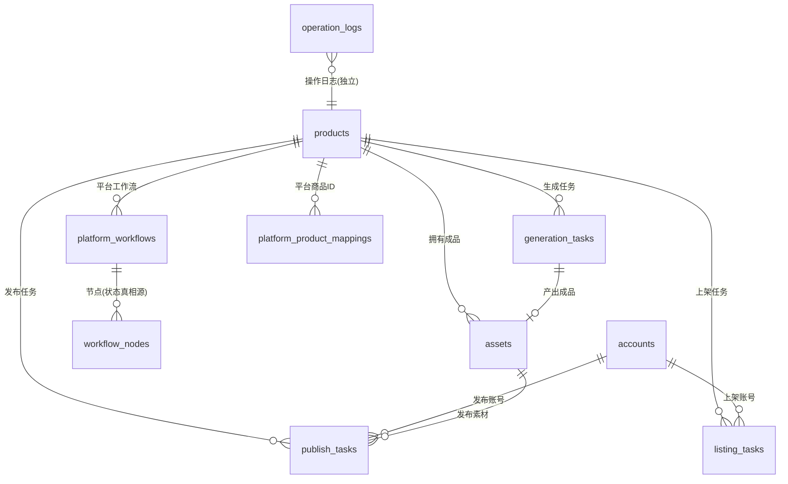

# 阶段一 · 数据层设计(SQLite 重建)

> 目标:用关系型 SQLite 替换 `data/db.json` 单文件,根治并发丢更新 / 无事务 / 无约束 / 状态分叉。
> 前提(已与你确认):**db.json 里的数据多为测试/mock,不做忠实迁移;只有「关键的图和视频」要保住——已通过 `scripts/rescue-media.js` 抢救到 `media-backup/`(8 图 + 2 视频 + 2 根视频,带 manifest)。** 因此本阶段是**干净重建 + 极简导入**,而非高危的全量 ETL。

---

## 0. 设计原则

1. **状态单一真相源**:商品上的 `imageStatus/copyStatus/videoStatus/listingStatus/publishStatus/progress` **不再落库**,改为从 `generation_tasks` / `workflow_nodes` / `listing_tasks` / `publish_tasks` 派生(SQL 视图或查询聚合)。结构上杜绝现状的 P1025/P1022 式分叉。
2. **消除反范式冗余**:删除 `productName` / `assetName` / `account`(名字)等到处抄的字段,改用外键 + JOIN。
3. **真实时间戳**:所有时间一律 `INTEGER`(Unix 毫秒,UTC)或 ISO-8601 文本;逐出 `"刚刚"`/`"14:51"` 这类展示字符串(这也是后续风控「日上限/间隔≥4h」、数据回流的前提)。
4. **ID 用 cuid**(Prisma 内置 `@default(cuid())`):文本主键,有序、并发无冲突、删除不复用;同时保留 `displayCode`(如 `P1027`、`SKU-DRAFT-27`)作为人类可读的业务编号。
5. **内嵌数组提升为表**:`platformWorkflows.nodes[]` → `workflow_nodes` 表;`platformProductIds{}` → `platform_product_mappings` 表。
6. **不改 27 个 service 的对外签名**:新增 `repositories/` 层封装数据访问,service 继续调 `getProductById(...)` 之类,只是底层从「读全量 JSON」换成「Drizzle 查询」。这是绞杀者迁移的关键——业务逻辑零改动。

---

## 1. 实体关系总览



---

## 2. 表结构(逐表说明 + 与旧字段映射)

> 约定:所有表含 `id`(主键,Prisma `@default(cuid())`)、`created_at`/`updated_at`(真实 `DateTime`);软删除用 `deleted_at DateTime NULL`。下面只列业务列。

### products — 商品
| 列 | 类型 | 说明 / 旧字段映射 |
|---|---|---|
| display_code | TEXT | 旧 `id`(P1027)保留为业务编号,便于对照 |
| sku_code | TEXT | 旧 `code` |
| name | TEXT NOT NULL | |
| category | TEXT | |
| price_cents | INTEGER | 旧 `price`(元)→ **统一存「分」**,杜绝浮点 |
| stock | INTEGER | |
| warning_stock | INTEGER | 旧 `warningStock` |
| selling_points | TEXT | |
| specs | TEXT | |
| platforms | TEXT(JSON) | 旧 `platforms[]`,低频读、保留 JSON 即可 |
| colors | TEXT(JSON) NULL | UI 用,保留 JSON |
| status | TEXT | 商品业务态(待发布/已上架…),受控枚举 |
| ~~imageStatus/copyStatus/videoStatus/listingStatus/publishStatus/progress~~ | — | **删除**,改派生(见 §4 视图) |
| ~~accounts[]/platformProductIds{}~~ | — | 拆出(见 mappings 表;账号关联走任务) |

### accounts — 平台账号(主店/授权号/达人号)
| 列 | 类型 | 说明 |
|---|---|---|
| platform | TEXT | 抖音/小红书/淘宝 |
| name | TEXT | |
| type | TEXT | 店铺账号 / 内容账号 |
| role | TEXT | main_shop / authorized / creator(矩阵角色) |
| auth | TEXT | 已授权/未授权/授权已失效… |
| rule | TEXT | 发布规则文本(含「每天 N 条」,风控解析用) |
| persona | TEXT | 人设 |
| is_demo | INTEGER(bool) | 旧 `demo` |

### assets — 成品(图/文/视频)
| 列 | 类型 | 说明 / 映射 |
|---|---|---|
| product_id | TEXT FK→products | |
| generation_task_id | TEXT FK→generation_tasks NULL | 旧 `generationTaskId` |
| kind | TEXT | image / copy / video |
| type | TEXT | 商品主图/详情文案/商品展示视频… |
| name | TEXT | |
| status | TEXT | 已生成/生成失败/已发布… 受控枚举 |
| usage | TEXT | 成品库/发布任务… |
| version | TEXT | |
| provider | TEXT | runninghub / template / deepseek |
| is_primary | INTEGER(bool) | |
| content | TEXT NULL | 文案正文(copy 类) |
| media_url | TEXT NULL | 旧 `imageUrl`/`videoUrl` 统一为一列;**导入时重指向 `media-backup/` 本地文件** |
| poster_url | TEXT NULL | 旧 `posterUrl`/`coverUrl` |
| aspect_ratio | TEXT NULL | |
| duration | TEXT NULL | 视频时长 |

### platform_workflows — 平台工作流实例
| 列 | 类型 | 说明 / 映射 |
|---|---|---|
| product_id | TEXT FK→products | |
| platform | TEXT | |
| template | TEXT | 抖音链路/小红书链路/淘宝链路 |
| status | TEXT | 执行中/等待确认/失败/已完成 |
| current_node_id | TEXT NULL | 旧 `currentNodeId` |
| ~~productName/progress~~ | — | **删除**:productName 改 JOIN;progress 改派生(已成功节点/总节点) |

### workflow_nodes — 工作流节点(**流程状态的唯一真相源**)
| 列 | 类型 | 说明 |
|---|---|---|
| workflow_id | TEXT FK→platform_workflows | |
| node_key | TEXT | generate_image / create_listing …(对齐 `PLATFORM_CHAINS`) |
| seq | INTEGER | 节点顺序 |
| label | TEXT | |
| type | TEXT | manual/generate/listing/observe/publish |
| kind | TEXT NULL | image/copy/video(generate 类) |
| status | TEXT | 未开始/可执行/执行中/待确认/已成功/失败/已跳过(受控 7 态) |
| error | TEXT NULL | |
| meta | TEXT(JSON) NULL | 旧 `taskId/taskIds[]/hint/params` 归并 |

### generation_tasks — 生成任务
`product_id` FK、`platform_workflow_id` FK NULL、`kind`、`type`、`label`、`params`(JSON)、`status`、`asset_id` FK NULL、`provider`、`error`、`attempts`、`max_attempts`、`started_at`、`finished_at`。删 `productName/assetName` 冗余。

### listing_tasks — 上架任务
`product_id` FK、`account_id` FK(替代旧 `account` 名字)、`platform`、`status`、`completeness`、`missing`(JSON)、`mode`、`platform_mode`、`platform_capability`、`external_id`、`platform_response`(JSON)、`failure_reason`、`attempts`、`max_attempts`。

### publish_tasks — 发布任务
`product_id` FK、`account_id` FK(替代旧 `account` 名)、`asset_id` FK、`platform`、`status`、`schedule_slot`、`scheduled_at`(**真实时间**,替代 `time:"今天18:00"`)、`published_at`、`attach_product`(bool)、`mode`、`failure_reason`、`attempts`、`max_attempts`。

### platform_product_mappings — 平台商品ID映射
`product_id` FK、`platform`、`external_product_id`(旧 `platformProductIds{平台:PID}` 拆成行)。唯一约束 `(product_id, platform)`。

### operation_logs — 操作日志(独立,最先迁出主库)
`product_id` FK NULL、`kind`、`message`、`level`、`created_at`。**独立表/独立 db 文件**,避免 372+ 条日志拖慢主库写入。

---

## 3. Prisma Schema(实际可运行文件:`prisma/schema.prisma`)

> **已落地。** 实际采用 **Prisma 6**(决策见 §7-1),完整 schema 在 `prisma/schema.prisma`,用 `DateTime` 存真实时间、`@default(cuid())` 作主键、关系/索引/唯一约束齐备。下方保留早期 Drizzle 草案仅作字段对照,**以 `prisma/schema.prisma` 为准**。

### 早期 Drizzle 草案(已被 Prisma 取代,仅供字段参考)

```ts
import { sqliteTable, text, integer } from "drizzle-orm/sqlite-core";

const base = {
  id: text("id").primaryKey(),                  // ULID
  createdAt: integer("created_at").notNull(),
  updatedAt: integer("updated_at").notNull(),
  deletedAt: integer("deleted_at"),
};

export const products = sqliteTable("products", {
  ...base,
  displayCode: text("display_code"),
  skuCode: text("sku_code"),
  name: text("name").notNull(),
  category: text("category"),
  priceCents: integer("price_cents"),
  stock: integer("stock").default(0),
  warningStock: integer("warning_stock").default(0),
  sellingPoints: text("selling_points"),
  specs: text("specs"),
  platforms: text("platforms", { mode: "json" }).$type<string[]>(),
  colors: text("colors", { mode: "json" }).$type<string[]>(),
  status: text("status"),
});

export const accounts = sqliteTable("accounts", {
  ...base,
  platform: text("platform"),
  name: text("name"),
  type: text("type"),
  role: text("role"),               // main_shop | authorized | creator
  auth: text("auth"),
  rule: text("rule"),
  persona: text("persona"),
  isDemo: integer("is_demo", { mode: "boolean" }).default(false),
});

export const platformWorkflows = sqliteTable("platform_workflows", {
  ...base,
  productId: text("product_id").notNull().references(() => products.id),
  platform: text("platform").notNull(),
  template: text("template"),
  status: text("status"),
  currentNodeId: text("current_node_id"),
});

export const workflowNodes = sqliteTable("workflow_nodes", {
  ...base,
  workflowId: text("workflow_id").notNull().references(() => platformWorkflows.id),
  nodeKey: text("node_key").notNull(),
  seq: integer("seq").notNull(),
  label: text("label"),
  type: text("type"),
  kind: text("kind"),
  status: text("status").notNull().default("未开始"),
  error: text("error"),
  meta: text("meta", { mode: "json" }),
});

export const assets = sqliteTable("assets", {
  ...base,
  productId: text("product_id").notNull().references(() => products.id),
  generationTaskId: text("generation_task_id"),
  kind: text("kind").notNull(),     // image | copy | video
  type: text("type"),
  name: text("name"),
  status: text("status"),
  usage: text("usage"),
  version: text("version"),
  provider: text("provider"),
  isPrimary: integer("is_primary", { mode: "boolean" }).default(false),
  content: text("content"),
  mediaUrl: text("media_url"),
  posterUrl: text("poster_url"),
  aspectRatio: text("aspect_ratio"),
  duration: text("duration"),
});
// generation_tasks / listing_tasks / publish_tasks / platform_product_mappings /
// operation_logs 同理（见 §2 列定义）
```

**运行时(实际)**:Prisma 6 + SQLite;迁移用 `prisma migrate dev` 生成版本化 SQL(`prisma/migrations/`);数据可视化用 `prisma studio`(非技术维护者像 Excel 一样看/改库);备份用 Litestream 挂 WAL 近实时复制到对象存储(阶段后期接)。

---

## 4. 派生状态(替代商品上的冗余状态字段)

商品卡片要的 `imageStatus` 等改为**查询时派生**,例:

```sql
CREATE VIEW product_status_v AS
SELECT p.id AS product_id,
  (SELECT status FROM generation_tasks t
     WHERE t.product_id=p.id AND t.kind='image'
     ORDER BY t.updated_at DESC LIMIT 1)               AS image_status,
  (SELECT COUNT(*) FROM workflow_nodes n
     JOIN platform_workflows w ON w.id=n.workflow_id
     WHERE w.product_id=p.id AND n.status IN ('已成功','已跳过')) AS done_nodes
FROM products p;
```

→ 分叉在结构上不可能再发生(只有一个地方写 `generation_tasks.status`)。

---

## 5. 极简导入(替代高危 ETL)

`scripts/import-from-json.js`(一次性、幂等):

1. **只导入有真实媒体的商品**:据 `media-backup/manifest.json`,涉及 `P1021/P1022/P1024/P1025/P1026/P1027` 等约 6 个商品。
2. **导入这些商品的真实 image/video/copy 资产**,`media_url` **重指向 `media-backup/` 本地文件**(原 COS 链接进 `meta` 留档)。
3. **导入 8 个 accounts**(矩阵配置,体量小、有用)。
4. **不导入**:旧 `platformWorkflows`/`generationTasks`/`listingTasks`/`publishTasks`/`logs`(都是测试/mock 态)——这些商品进系统后用新引擎**重新跑工作流**即可。
5. 价格 `元 → 分`、时间戳 `→ 真实 UTC`、ID `→ cuid`(旧 ID 存 `display_code`)。
6. 跑完用计数校验,旧 `db.json` 保留只读备份。

> 这样新库**一开始就是干净的真实数据**(6 个有图有视频的商品 + 账号矩阵),没有任何 mock 噪音。

---

## 6. 仓储层(service 零改动的关键)

```
src/repositories/product.repo.ts   →  getProductById / listProducts / saveProduct(走事务)
src/repositories/workflow.repo.ts   →  getWorkflow / updateNodeStatus(原子)
src/repositories/asset.repo.ts …
```
现有 `lib/*-service.js` 内部把「`db.products.find(...)`」换成「`productRepo.getById(...)`」,**对外导出的函数签名不变**,server.js 调用方也不变。

---

## 7. 决策(已确认)

1. **ORM = Prisma 6**(已定)。理由:维护者非技术 + 产品后续售卖 → Prisma Studio 可视化看/改库、迁移全自动、生态/AI 最熟,综合最省心。**用 6 不用 7**:Prisma 7 不再支持 schema 内 `url`、需 `prisma.config.ts` + native 驱动适配器,对非技术维护者是没必要的新坑;6 用经典「url 写在 schema」模型,文档最全。
2. **演示模式**:阶段一只保证 `is_demo` 字段存在(已建);阶段三再把演示从「默认真」改「显式真」。
3. **导入范围 = 最小集**(已定):6 个有真实媒体的商品(P1021/P1022/P1024/P1025/P1026/P1027)+ 8 账号,媒体重指向 `media-backup/`,其余 mock 全丢。

---

## 8. 验收标准

- ① 所有现有功能在新库上回归通过(靠阶段0 的测试 + 手点关键链路);
- ② 并发两个写请求不丢更新(事务保证);
- ③ 外键约束开启、无孤儿数据;
- ④ 商品状态由任务/节点派生、无法再人为分叉;
- ⑤ 6 个真实商品的图/视频在页面正常显示(指向 media-backup 本地文件);
- ⑥ `db.json` 保留只读备份,可随时对照。

---

## 9. 实现进展(2026-06-16)

**已完成并验证(新库与旧 JSON 并存,旧数据未动)**:
- `prisma/schema.prisma`:10 张表(products/accounts/assets/platform_workflows/workflow_nodes/generation_tasks/listing_tasks/publish_tasks/platform_product_mappings/operation_logs),含关系/索引/唯一约束。
- `prisma migrate dev` 建库:`data/app.db` + 版本化迁移 `prisma/migrations/20260616_init`。
- `scripts/import-from-json.js`(幂等):导入 **6 商品 + 8 账号 + 13 资产(image 8 / video 2 / copy 3)+ 2 平台商品ID映射**;媒体重指向 `media-backup/` 本地文件(实测文件存在);价格转分、时间戳为真实 UTC、商品无派生状态字段。
- 验证:P1027 价格 5000 分、真实 `createdAt`、无 `imageStatus` 字段、媒体路径有效。
- **仓储层已建** `lib/repositories/`(products/accounts/assets/workflows/status + client 单例):Prisma 封装、领域函数式、**数据访问唯一边界**(应用不直接 import @prisma/client)。`status.js` 实现「派生状态」(从资产/节点派生 imageStatus/进度,替代旧的落库状态字段)。`scripts/verify-repositories.js` 对真实 app.db 验证通过。

**排序决策(重要)**:**不**把旧的 2000 行 `server.js` + 27 个 service 回填改读 SQLite——该后端阶段二将被 Fastify 整体替换,为其写「干净 schema → 旧反范式形状」的翻译层是抛弃性工作。改为:**旧 app 暂留在 `db.json`(作只读参考),仓储层直接供阶段二新后端使用**。

**本阶段剩余 / 顺延到阶段二**:
1. ~~仓储层~~ ✅ 已完成(`lib/repositories/`)。
2. 阶段二新后端(Fastify)接仓储层提供读/写端点;`media-backup/` 静态路由随新后端一并加,让页面显示本地图/视频。
3. 派生状态:已在 `status.js` 落地函数式派生;如需 SQL 视图 `product_status_v` 可后续加。
4. 仓储层补全写操作(事务)与剩余实体(generation/listing/publish/log)的 repo;阶段二端点齐后旧 `db.json` 退役为只读备份。
